# ElasticSearch7.6入门学习笔记


本笔记主要参考自原文：https://www.kuangstudy.com/bbs/1354069127022583809


学习视频教程：

狂神说Java的ElasticSearch教程：https://www.bilibili.com/video/BV17a4y1x7zq?vd_source=763b2ec1aba2026d6d6983dd3bd86607

尚硅谷ElasticSearch教程：https://www.bilibili.com/video/BV1hh411D7sb


学习代码：https://github.com/caojx-git/eleasticsearch-springboot-learn


6.X  7.X的区别十分大，本教程使用的是7.6版本


# 一、故事

## 聊聊Doug Cutting 

> 本故事内容来自公众号：鲜枣课堂

1998年9月4日，Google公司在美国硅谷成立。正如大家所知，它是一家做**搜索**引擎起家的公司。


无独有偶，一位名叫**Doug Cutting**l的美国工程师，也迷上了搜索引擎。他做了一个用于**文本搜索的函数库**（姑且理解为软件的功能组件)，命名为**Lucene**。


Lucene是用Java写成的，目标是为各种中小型应用软件加入<font color=red>全文检索功能</font>。因为好用而且<font color=red>开源</font>（代码公开），非常受程序员们的欢迎。

早期的时候，这个项目被发布在Doug Cutting的个人网站和SourceForge(一个开源软件网站)。后来，2001年底，Lucene)成为

**Apache软件基金会**jakarta项目的一个子项目。


2004年，Doug Cutting再接再励，在Lucene的基础上，和Apache：开源伙伴Mike Cafarella合作，开发了一款可以代替当时的主流搜索的开源搜索引擎，命名为**Nutch。**


Nutch是一个建立在Lucene核心之上的网页搜索应用程序，可以下载下来直接使用。它在Lucene的基础上加了网络爬虫和一些网页相关的功能，目的就是从一个简单的站内检索推广到全球网络的搜索上，就像Google一样。

Nutch在业界的影响力比Lucene更大。

大批网站采用了Nutch平台，大大降低了技术门槛，使低成本的普通计算机取代高价的Wb服务器成为可能。甚至有一段时间，在硅谷有了一股用Nutch低成本创业的潮流。

**随着时间的推移，无论是Google还是Nutch，都面临搜索对象”体积“不断增大的问题。(大数据问题)，**尤其是Google，作为互联网搜索引擎，需要存储大量的网页，并不断优化自己的搜索算法，提升搜索效率。


在这个过程中，Google确实找到了不少好功法，<font color=red>并且无私地分享了出来</font>。


<font color=red>**大数据就两个问题：存储问题+计算问题**</font>


2003年，Google发表了一篇技术学术论文，公开介绍了自己的谷歌文件系统**GFS（Google File System)**。这是Google公司为了<font color=red>存储海量搜索数据</font>而设计的专用文件系统。

第二年，也就是2004年，Doug Cutting基于Google的GFS论文，实现了<font color=red>**分布式文件存储系统**</font>，并将它命名为**NDFS（Nutch Distributed File System )**


还是2004年，Google又发表了一篇技术学术论文，介绍自己的**MapReduce编程模型**。这个编程模型，用于大规模数据集（大于

1TB)的并行分析运算。

第二年(2005年)，Doug Cutting。又基于MapReduce，在Nutch搜索引擎实现了该功能，提高了全文检索的速度。


2006年，当时依然很厉害的** **，招安了Doug Cutting。


加盟Yahoo之后，Doug Cutting 将NDFS和MapReduce进行了升级改造，并重新命名为**Hadoop** （NDFS也改名为HDFS，Hadoop Distributed File System )

这个，就是后来大名鼎鼎的大数据框架系统一一Hadoop的由来。而Doug Cutting，则被人们称为**Hadoop之父。**


Hadoop这个名字，实际上是Doug Cutting他儿子的黄色玩具大象的名字。所以，Hadoop的Logo，就是一只奔跑的黄色大象。


我们继续往下说

还是2006年，Google又发论文了。

这次，它们介绍了自己的**BigTable**。这是一种分布式数据存储系统，一种用来处理海量数据的非关系型数据库。

Doug Cutting当然没有放过，在自己的hadoop系统里面，引入了BigTable，并命名为**HBase**。


好吧，反正就是紧跟Google时代步伐，你出什么，我学什么。

所以，Hadoopl的核心部分，基本上都有Google的影子。 


2008年1月，Hadoop成功上位，正式成为Apache基金会的顶级项目。I

同年2月，Yahoo宣布建成了一个拥有1万个内核的Hadoop集群，并将自己的搜索引擎产品部署在上面。

7月，Hadoop打破世界纪录，成为最快排序1TB数据的系统，用时209秒。


> 回到主题

在学习ElasticSearch之前，先简单了解一下**Lucene**：

- Lucene是一套信息检索工具包，是一个jar包，不包含搜索擎系统

- Lucene包含：索引结构、读写索引的工具、排序、搜索规则...工具类

- **Doug Cutting开发**
- 是**apache软件基金会**4 jakarta项目组的一个子项目
- 是一个**开放源代码**的**全文检索引擎工具包**
- **不是一个完整的全文检索引擎，而是一个全文检索引擎的架构**，提供了完整的查询引擎和索引引擎，部分[文本分析](https://baike.baidu.com/item/文本分析/11046544)引擎（英文与德文两种西方语言）
- 当前以及最近几年最受欢迎的**免费Java信息检索程序库**。

**Lucene和ElasticSearch的关系：**

- ElasticSearch是基于Lucene 做了一下封装和增强，我们上手十分简单


# 二、ElasticSearch概述

> 官网：https://www.elastic.co/cn/downloads/elasticsearch

**Elaticsearch**，简称为es，es是一个开源的**高扩展**的<font color=red>**分布式全文检索引擎**</font>，它可以近乎<font color=red>**实时的存储**、**检索数据;**</font> 本身扩展性很好，可以扩展到上百台服务器，处理PB级别(大数据时代）的数据。**es也使用java开发并使用Lucene作为其核心**来实现所有索引和搜索的功能，但是它的**目的**是<mark>通过简单的 <font color=red>**RESTful API**</font> 来隐藏Lucene的复杂性，从而让全文搜索变得简单</mark>。


据国际权威的数据库产品评测机构DB Engines的统计，在2016年1月，ElasticSearch已超过Solr等，成为<font color=red>**排名第一的搜索引擎类应用**。</font>


## 历史

多年前，一个叫做Shay Banon的刚结婚不久的<font color=red>失业开发者</font>，由于妻子要去伦敦学习厨师，他便跟着也去了。在他找工作的过程中，为了给妻子构建一个食谱的搜索引擎，他开始构建一个早期版本的Lucene。

直接基于Lucene工作会比较困难，所以Shay开始抽象Lucene代码以便Java程序员可以在应用中添加搜索功能。他发布了他的第一个开源项目，叫做“Compass”。

后来Shay找到一份工作，这份工作处在高性能和内存数据网格的分布式环境中，因此高性能的、实时的、分布式的搜索引擎也是理所当然需要的。然后他决定重写Compass库使其成为一个独立的服务叫做<font color=red>Elasticsearch。</font>

第一个公开版本出现在2010年2月，在那之后Elasticsearch已经成为Github上最受欢迎的项目之一，代码贡献者超过300人。一家主营Elasticsearch的公司就此成立，他们一边提供商业支持一边开发新功能，不过Elasticsearch将永远开源且对所有人可用。

Shay的妻子依旧等待着她的食谱搜索….


## **谁在使用**

1、维基百科，类似百度百科，全文检索，高亮，搜索推荐

2、The Guardian (国外新闻网站) ，类似搜狐新闻，用户行为日志(点击，浏览，收藏，评论) +社交网络数据(对某某新闻的相关看法) ，数据分析，给到每篇新闻文章的作者，让他知道他的文章的公众反馈(好，坏，热门，垃圾，鄙视，崇拜)

3、Stack Overflow (国外的程序异常讨论论坛) ， IT问题，程序的报错，提交上去，有人会跟你讨论和回答，全文检索，搜索相关问题和答案，程序报错了，就会将报错信息粘贴到里面去，搜索有没有对应的答案

4、GitHub (开源代码管理)，搜索上千亿行代码

5、电商网站，检索商品

6、日志数据分析， logstash采集日志， ES进行复杂的数据分析， <font color=red>**ELK技术， elasticsearch+logstash+kibana** </font>

7、商品价格监控网站，用户设定某商品的价格阈值，当低于该阈值的时候，发送通知消息给用户，比如说订阅牙膏的监控，如果高露洁牙膏的家庭套装低于50块钱，就通知我，我就去买

8、BI系统，商业智能， Business Intelligence。比如说有个大型商场集团，BI ，分析一下某某区域最近3年的用户消费 金额的趋势以及用户群体的组成构成，产出相关的数张报表， **区，最近3年，每年消费金额呈现100%的增长，而且用户群体85%是高级白领，开-个新商场。ES执行数据分析和挖掘， Kibana进行数据可视化

9、国内:站内搜索(电商，招聘，门户，等等)，IT系统搜索(OA，CRM，ERP，等等)，数据分析(ES热门的一一个使用场景)


## ES和Solr差别


### ElasticSearch简介

- Elasticsearch是一个<font color=red>**实时分布式搜索和分析引擎**</font>。 它让你以前所未有的速度处理大数据成为可能。
- 它用于<mark>**全文搜索、结构化搜索、分析**</mark>以及将这三者混合使用:
- `维基百科`使用Elasticsearch提供**全文搜索**并**高亮关键字**，以及输入**实时搜索**(search-asyou-type)和**搜索纠错**(did-you-mean)等搜索建议功能。
- `英国卫报`使用Elasticsearch结合用户日志和社交网络数据提供给他们的编辑以实时的反馈，以便及时了解公众对新发表的文章的回应。
- `StackOverflow`结合全文搜索与地理位置查询，以及more-like-this功能来找到相关的问题和答案。
- `Github`使用Elasticsearch检索1300亿行的代码。
- 但是Elasticsearch不仅用于大型企业，它还让像`DataDog`以及`Klout`这样的创业公司将最初的想法变成可扩展的解决方案。
- Elasticsearch可以在你的笔记本上运行，也可以在数以百计的服务器上处理PB级别的数据。
- Elasticsearch是一个基于Apache Lucene(TM)的开源搜索引擎。无论在开源还是专有领域， Lucene可被认为是迄今为止最先进、性能最好的、功能最全的搜索引擎库。
  - 但是， **Lucene只是一个库**。 想要使用它，你必须使用Java来作为开发语言并将其直接集成到你的应用中，更糟糕的是， Lucene非常复杂，你需要深入了解检索的相关知识来理解它是如何工作的。
- Elasticsearch也使用Java开发并使用Lucene作为其核心来实现所有索引和搜索的功能，但是它的**目的**是<mark>通过简单的<font color=red>**RESTful API**</font>来隐藏Lucene的复杂性，从而让全文搜索变得简单。</mark>


### Solr简介

- Solr是Apache下的一个顶级开源项目，采用Java开发，它是**基于Lucene的全文搜索服务器**。Solr提供了比Lucene更为**丰富的查询语言**，同时实现了**可配置**、**可扩展**，并**对索引、搜索性能进行了优化**
- Solr可以**独立运行**，运行在letty、Tomcat等这些Selrvlet容器中 ， Solr 索引的实现方法很简单，<mark> <font color=red>用POST方法向Solr服务器发送一个描述Field及其内容的XML文档， Solr根据xml文档**添加、删除、更新**索引</font></mark>。Solr 搜索只需要发送HTTP GET请求，然后对Solr返回xml、json等格式的查询结果进行解析，组织页面布局。
- Solr不提供构建UI的功能， **Solr提供了一个管理界面，通过管理界面可以查询Solr的配置和运行情况。**
- Solr是基于lucene开发企业级搜索服务器，实际上就是封装了lucene.
- Solr是一个独立的企业级搜索应用服务器，它**对外提供类似于<font color=red>Web-service的API接口</font>**。用户可以通过http请求，向搜索引擎服务器提交一定格式的文件，生成索引；也可以通过提出查找请求，并得到返回结果。


### Lucene简介

Lucene是apaches软件基金会4 jakarta项目组的一个子项目，是一个开放源代码的全文检索引擎工具包，但它不是一个完整的全文检索引擎，而是一个全文检索引擎的架构，提供了完整的查询引擎和索引引擎，部分文本分析引擎（英文与德文两种西方语言）。

Lucene的目的是为软件开发人员提供一个简单易用的工具包，以方便的在目标系统中实现全文检索的功能，或者是以此为基础建立起完整的全文检索引擎。Lucene是一套用于全文检索和搜寻的开源程式库，由Apache软件基金会支持和提供。Lucene提供了一个简单却强大的应用程式接口，能够做全文索引和搜寻。<font color=red>在Java开发环境里Lucene是一个成熟的免费开源工具。就其本身而言，Lucene是当前以及最近几年最受欢迎的免费ava信息检索程序库。</font> 人们经常提到信息检索程序库，虽然与搜索引擎有关，但不应该将信息检索程序库与搜索引擎相混淆。

Lucene是一个全文检索引擎的架构。那什么是全文搜索引擎？

全文搜索引擎是名副其实的搜索引擎，国外具代表性的有Google、Fast/AllTheWeb、AltaVista、Inktomi、Teoma、WiseNut等， 国内著名的有百度（Baidu)。它们都是通过从互联网上提取的各个网站的信息（以网页文字为主）而建立的数据库中，检索与用户查询条件匹配的相关记录，然后按一定的排列顺序将结果返回给用户，因此他们是真正的搜索引擎。

从搜索结果来源的角度，全文搜索引擎又可细分为两种，一种是拥有自己的检索程序(Indexer)，俗称“蜘蛛”(Spider)程序或“机器人”(Robot)程序，并自建网页数据库，搜索结果直接从自身的数据库中调用，如上面提到的7家引擎；另一种则是租用其他引擎的数据库，并按自定的格式排列搜索结果，如Lycos引擎。


### ElasticSearch与Solr比较

**架构的选择**


>  当单纯的对已有数据进行搜索时，Solr更快

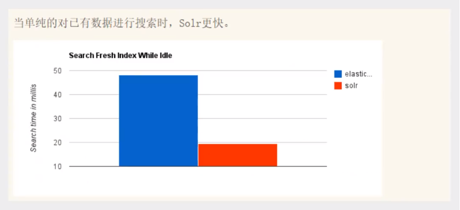


>  当实时建立索引时，Solr会产生io阻塞，查询性能较差，ElasticSearch具有明显的优势

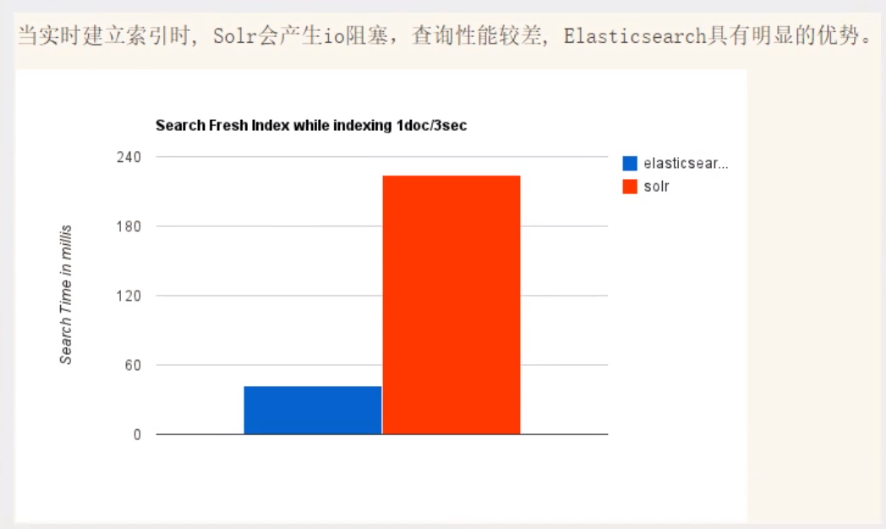


>  随着数据量的增加，Solr的搜索效率会变得更低，而ElasticSearch却没有明显的变化

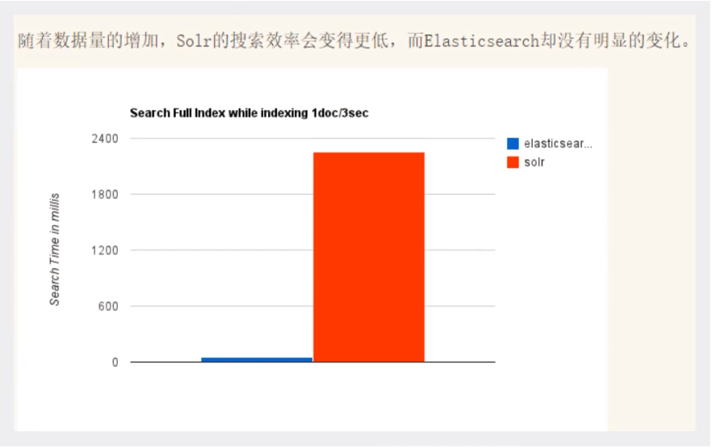


>  转变我们的搜索基础设施后从Solr ElasticSearch，我们看见一个即时~ 50x提高搜索性能！


**Elasticsearch VS Solr总结**

1、**es**基本是**开箱即用**(解压就可以用!) ，非常简单。Solr安装略微复杂一丢丢!

2、**Solr 利用Zookeeper进行分布式管理**，而**Elasticsearch<mark>自身带有分布式协调管理功能</mark>。**

3、Solr 支持更多格式的数据，比如JSON、XML、 CSV ，而**Elasticsearch仅支持json文件格式**。

4、Solr 官方提供的功能更多，而Elasticsearch本身更注重于核心功能，高级功能多有第三方插件提供，例如图形化界面需要kibana友好支撑

<mark>5、</mark>**Solr 查询快，但更新索引时慢(即插入删除慢)** ，用于电商等查询多的应用;

- **ES建立索引快(即查询慢)** ，即<font color=red>**实时性查询快**</font>，用于facebook新浪等搜索。

- Solr是传统搜索应用的有力解决方案，但Elasticsearch更适用于新兴的实时搜索应用。


6、Solr比较成熟，有一个更大，更成熟的用户、开发和贡献者社区，而Elasticsearch相对开发维护者较少，更新太快，学习使用成本较高。


# 三、ElasticSearch安装

<mark>JDK8，最低要求</mark>

使用Java开发，必须保证`ElasticSearch`的版本与Java的核心jar包版本对应！（Java环境保证没错）


> 这里在windows上进行安装

##  Windows下安装ElasticSearch

**1、安装**

下载地址：https://www.elastic.co/cn/downloads/

历史版本下载（这里我们先下载7.6.1 版本的）：https://www.elastic.co/cn/downloads/past-releases#elasticsearch

解压即可（尽量将ElasticSearch相关工具放在统一目录下）


**2、熟悉目录**

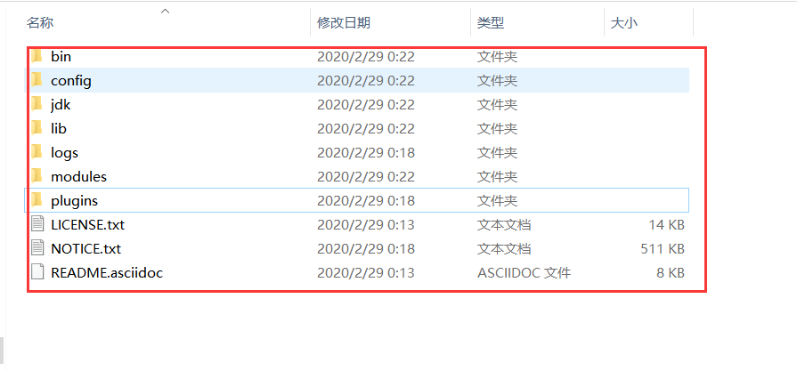

```nginx
bin 启动文件目录
config 配置文件目录
    1og4j2 日志配置文件
    jvm.options java 虚拟机相关的配置(默认启动占1g内存，内容不够需要自己调整)
    elasticsearch.ym1 elasticsearch 的配置文件! 默认9200端口!跨域!
1ib 
    相关jar包
modules 功能模块目录
plugins 插件目录
    比如ik分词器
```


**3、启动**

> 一定要检查自己的java环境是否配置好

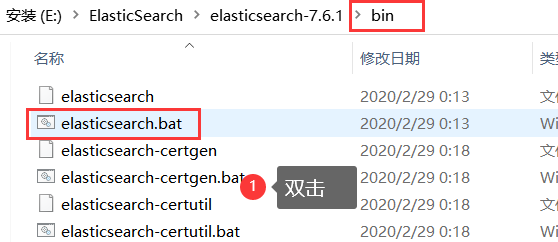


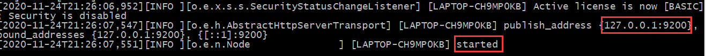


访问测试：http://localhost:9200/  

eleasticsearch 默认就是集群，默认集群名字叫：elasticsearch

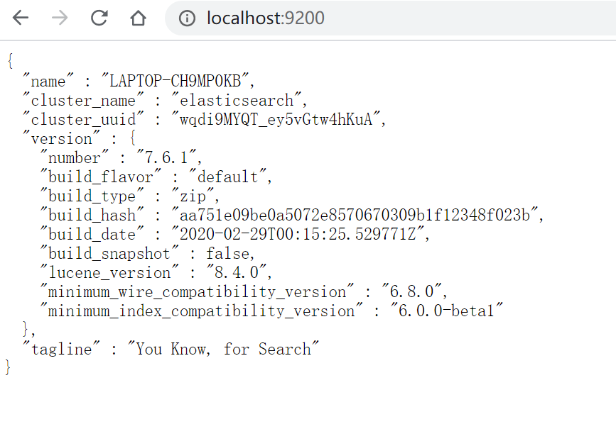


**提示：如果启动报错**

**打开config目录下的elasticsearch.yml，添加如下一行配置：**

```yaml
xpack.ml.enabled: false
```


```shell
[2022-06-19T17:48:07,279][ERROR][o.e.b.ElasticsearchUncaughtExceptionHandler] [caojxdeMacBook-Pro-435.local] uncaught exception in thread [main]
org.elasticsearch.bootstrap.StartupException: ElasticsearchException[Failure running machine learning native code. This could be due to running on an unsupported OS or distribution, missing OS libraries, or a problem with the temp directory. To bypass this problem by running Elasticsearch without machine learning functionality set [xpack.ml.enabled: false].]
	at org.elasticsearch.bootstrap.Elasticsearch.init(Elasticsearch.java:174) ~[elasticsearch-7.6.1.jar:7.6.1]
	at org.elasticsearch.bootstrap.Elasticsearch.execute(Elasticsearch.java:161) ~[elasticsearch-7.6.1.jar:7.6.1]
	at org.elasticsearch.cli.EnvironmentAwareCommand.execute(EnvironmentAwareCommand.java:86) ~[elasticsearch-7.6.1.jar:7.6.1]
	at org.elasticsearch.cli.Command.mainWithoutErrorHandling(Command.java:125) ~[elasticsearch-cli-7.6.1.jar:7.6.1]
	at org.elasticsearch.cli.Command.main(Command.java:90) ~[elasticsearch-cli-7.6.1.jar:7.6.1]
	at org.elasticsearch.bootstrap.Elasticsearch.main(Elasticsearch.java:126) ~[elasticsearch-7.6.1.jar:7.6.1]
	at org.elasticsearch.bootstrap.Elasticsearch.main(Elasticsearch.java:92) ~[elasticsearch-7.6.1.jar:7.6.1]
Caused by: org.elasticsearch.ElasticsearchException: Failure running machine learning native code. This could be due to running on an unsupported OS or distribution, missing OS libraries, or a problem with the temp directory. To bypass this problem by running Elasticsearch without machine learning functionality set [xpack.ml.enabled: false].
	at org.elasticsearch.xpack.ml.MachineLearning.createComponents(MachineLearning.java:587) ~[?:?]
	at org.elasticsearch.node.Node.lambda$new$9(Node.java:456) ~[elasticsearch-7.6.1.jar:7.6.1]
	at java.util.stream.ReferencePipeline$7$1.accept(ReferencePipeline.java:267) ~[?:1.8.0_251]
	at java.util.ArrayList$ArrayListSpliterator.forEachRemaining(ArrayList.java:1382) ~[?:1.8.0_251]
	at java.util.stream.AbstractPipeline.copyInto(AbstractPipeline.java:482) ~[?:1.8.0_251]
	at java.util.stream.AbstractPipeline.wrapAndCopyInto(AbstractPipeline.java:472) ~[?:1.8.0_251]
	at java.util.stream.ReduceOps$ReduceOp.evaluateSequential(ReduceOps.java:708) ~[?:1.8.0_251]
	at java.util.stream.AbstractPipeline.evaluate(AbstractPipeline.java:234) ~[?:1.8.0_251]
	at java.util.stream.ReferencePipeline.collect(ReferencePipeline.java:499) ~[?:1.8.0_251]
	at org.elasticsearch.node.Node.<init>(Node.java:459) ~[elasticsearch-7.6.1.jar:7.6.1]
	at org.elasticsearch.node.Node.<init>(Node.java:257) ~[elasticsearch-7.6.1.jar:7.6.1]
	at org.elasticsearch.bootstrap.Bootstrap$5.<init>(Bootstrap.java:221) ~[elasticsearch-7.6.1.jar:7.6.1]
	at org.elasticsearch.bootstrap.Bootstrap.setup(Bootstrap.java:221) ~[elasticsearch-7.6.1.jar:7.6.1]
	at org.elasticsearch.bootstrap.Bootstrap.init(Bootstrap.java:349) ~[elasticsearch-7.6.1.jar:7.6.1]
	at org.elasticsearch.bootstrap.Elasticsearch.init(Elasticsearch.java:170) ~[elasticsearch-7.6.1.jar:7.6.1]
	... 6 more
uncaught exception in thread [main]
ElasticsearchException[Failure running machine learning native code. This could be due to running on an unsupported OS or distribution, missing OS libraries, or a problem with the temp directory. To bypass this problem by running Elasticsearch without machine learning functionality set [xpack.ml.enabled: false].]
	at org.elasticsearch.xpack.ml.MachineLearning.createComponents(MachineLearning.java:587)
	at org.elasticsearch.node.Node.lambda$new$9(Node.java:456)
	at java.util.stream.ReferencePipeline$7$1.accept(ReferencePipeline.java:267)
	at java.util.ArrayList$ArrayListSpliterator.forEachRemaining(ArrayList.java:1382)
	at java.util.stream.AbstractPipeline.copyInto(AbstractPipeline.java:482)
	at java.util.stream.AbstractPipeline.wrapAndCopyInto(AbstractPipeline.java:472)
	at java.util.stream.ReduceOps$ReduceOp.evaluateSequential(ReduceOps.java:708)
	at java.util.stream.AbstractPipeline.evaluate(AbstractPipeline.java:234)
	at java.util.stream.ReferencePipeline.collect(ReferencePipeline.java:499)
	at org.elasticsearch.node.Node.<init>(Node.java:459)
	at org.elasticsearch.node.Node.<init>(Node.java:257)
	at org.elasticsearch.bootstrap.Bootstrap$5.<init>(Bootstrap.java:221)
	at org.elasticsearch.bootstrap.Bootstrap.setup(Bootstrap.java:221)
	at org.elasticsearch.bootstrap.Bootstrap.init(Bootstrap.java:349)
	at org.elasticsearch.bootstrap.Elasticsearch.init(Elasticsearch.java:170)
	at org.elasticsearch.bootstrap.Elasticsearch.execute(Elasticsearch.java:161)
	at org.elasticsearch.cli.EnvironmentAwareCommand.execute(EnvironmentAwareCommand.java:86)
	at org.elasticsearch.cli.Command.mainWithoutErrorHandling(Command.java:125)
	at org.elasticsearch.cli.Command.main(Command.java:90)
	at org.elasticsearch.bootstrap.Elasticsearch.main(Elasticsearch.java:126)
	at org.elasticsearch.bootstrap.Elasticsearch.main(Elasticsearch.java:92)
For complete error details, refer to the log at /Users/caojx/Downloads/elasticsearch-7.6.1/logs/elasticsearch.log
```


## 安装可视化界面Elasticsearch-Head


**使用前提**：需要安装nodejs


**1、下载地址**

下载github项目：https://github.com/mobz/elasticsearch-head

**2、安装**

解压即可（尽量将ElasticSearch相关工具放在统一目录下）

 **3、启动**

```shell
cd elasticsearch-head
# 安装依赖
cnpm install
# 启动
npm run start
# 访问
http://localhost:9100/
```

**安装依赖**

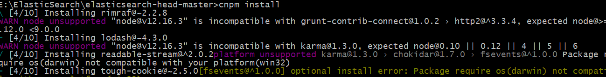


**运行**

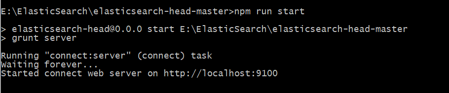


**访问 http://localhost:9100/**

> 存在跨域问题（只有当两个页面同源，才能交互）
>
> 同源（端口，主机，协议三者都相同）
>
> 什么是跨域？跨域解决方法：https://blog.csdn.net/qq_38128179/article/details/84956552


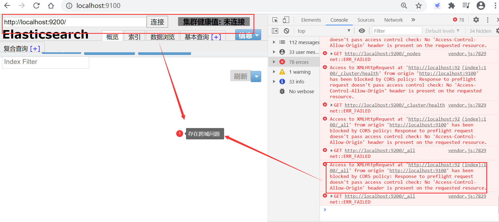

**开启跨域（在elasticsearch解压目录config下elasticsearch.yml中添加）**

```yaml
# 开启跨域
http.cors.enabled: true
# 所有人访问
http.cors.allow-origin: "*"
```


**重启elasticsearch再次连接**

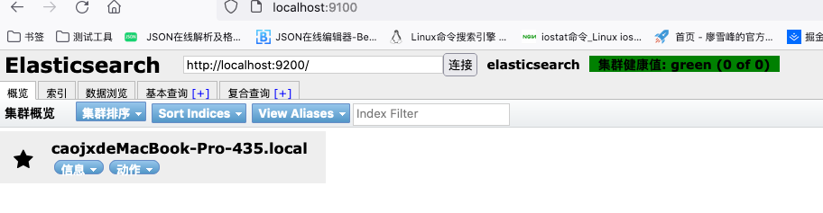


**新建索引测试**

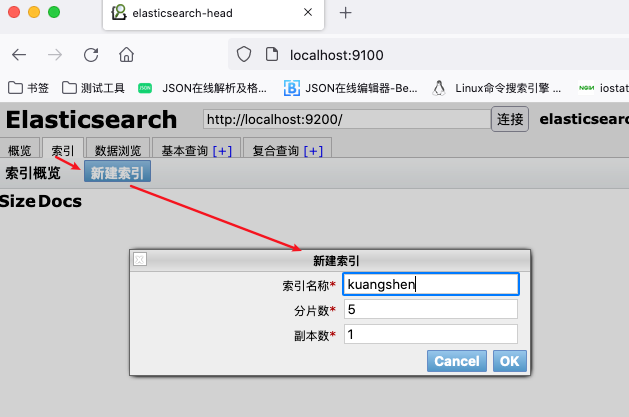


**如何理解上图：**

- 如果你是初学者

  - 索引： 可以看做 “数据库”
  - 类型： 可以看做 “表”，后续的版本中，类型将会淘汰
  - 文档： 可以看做 “库中的数据（表中的行）”

- 这个head，我们只是把它**当做可视化数据展示工具**，但是之后我们**所有的查询都在kibana中进行**

  - 因为不支持json格式化，不方便


## 安装kibana

Kibana是一个针对ElasticSearch的开源分析及可视化平台，用来搜索、查看交互存储在Elasticsearch索引中的数据。使用Kibana ，可以通过各种图表进行高级数据分析及展示。Kibana让海量数据更容易理解。它操作简单，基于浏览器的用户界面可以快速创建仪表板( dashboard )实时显示Elasticsearch查询动态。设置Kibana非常简单。无需编码或者额外的基础架构，几分钟内就可以完成Kibana安装并启动Elasticsearch索引监测。


**1、下载地址:**

> 下载的版本需要与ElasticSearch版本对应

https://www.elastic.co/cn/downloads/

历史版本下载（这里我们先下载7.6.1版本）：https://www.elastic.co/cn/downloads/past-releases/#kibana

**2、安装**

解压即可（尽量将ElasticSearch相关工具放在统一目录下）

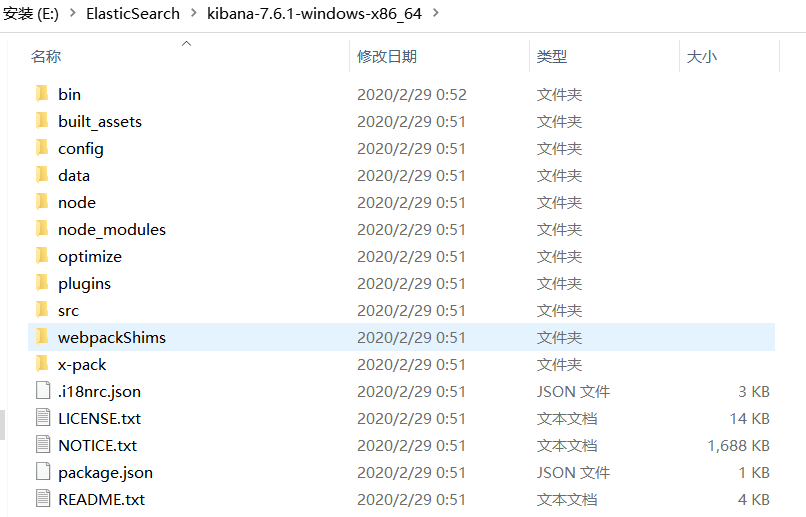

**3、启动**

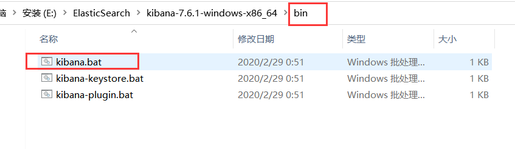

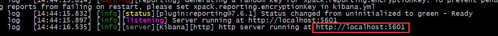


**访问：http://localhost:5601**


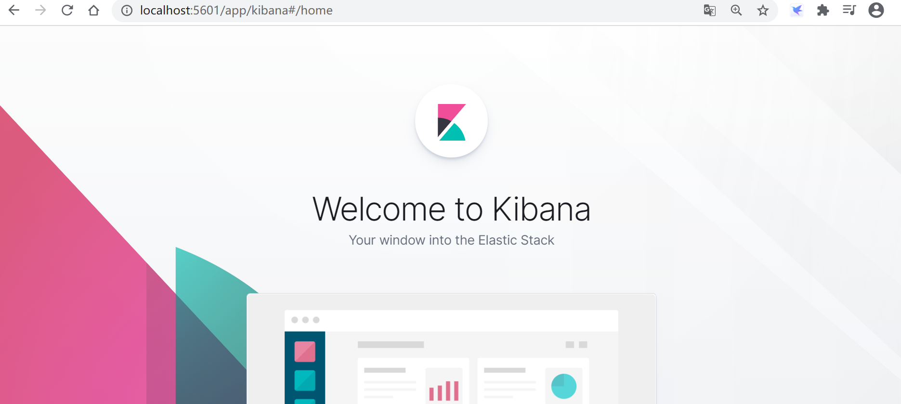


**4、开发工具**

很多人使用（Postman、curl、head、谷歌浏览器插件）这些工具来测试ElasticSearch，但是强烈推荐使用Kibana来测试


使用 `Kibana` dev_tools进行测试，之后所有的测试代码都在这里编写

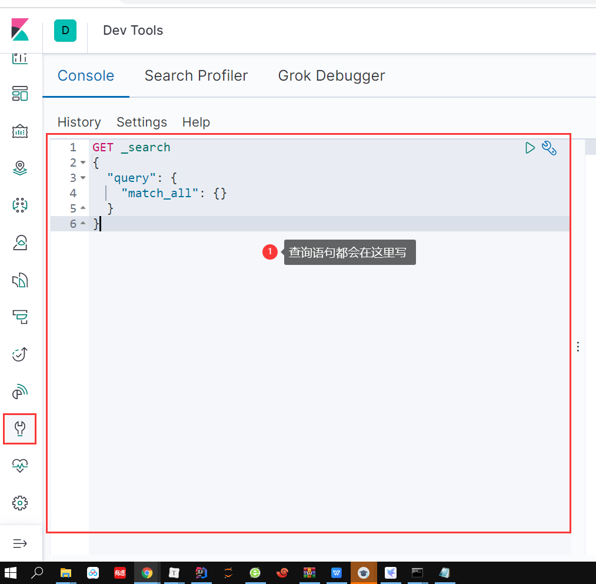


如果说，你在英文方面不太擅长，kibana是支持汉化的

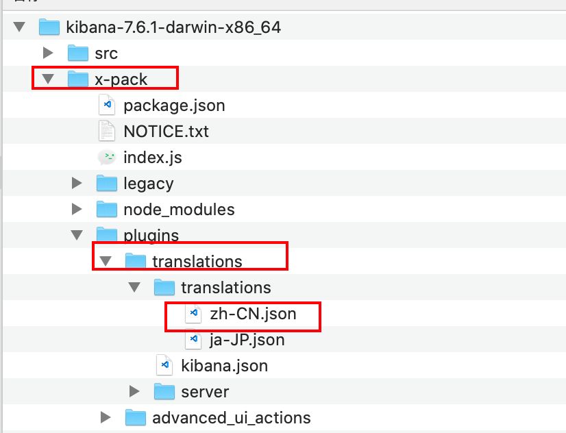


**5、kibana汉化**

编辑器打开`kibana解压目录/config/kibana.yml`，添加

```yaml
i18n.locale: "zh-CN"
```


**重启kibana汉化成功**

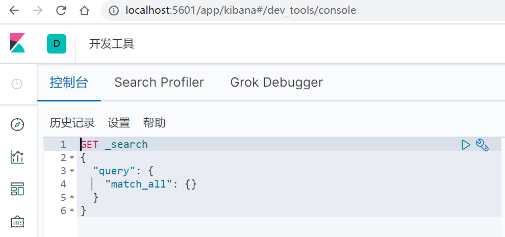


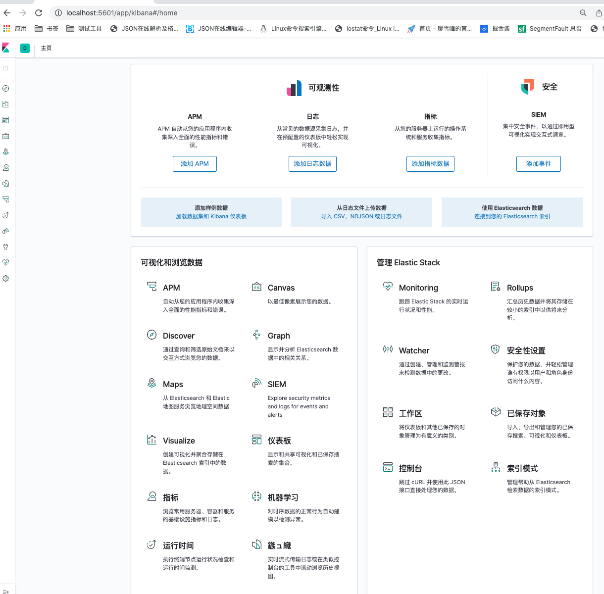


## **了解ELK**

ELK是**Elasticsearch、Logstash、 Kibana三大开源框架首字母大写简称**市面上也被成为Elastic Stack。其中Elasticsearch是一个基于Lucene、分布式、通过Restful方式进行交互的近实时搜索平台框架。像类似百度、谷歌这种大数据全文搜索引擎的场景都可以使用Elasticsearch作为底层支持框架，可见Elasticsearch提供的搜索能力确实强大，市面上很多时候我们简称Elasticsearch为es。

Logstash是ELK的中央数据流引擎，用于从不同目标(文件/数据存储/MQ )收集的不同格式数据，经过过滤后支持输出到不同目的地(文件/MQ/redis/elasticsearch/kafka等)。

Kibana可以将elasticsearch的数据通过友好的页面展示出来 ，提供实时分析的功能。

市面上很多开发只要提到ELK能够一致说出它是一个日志分析架构技术栈总称 ，但实际上ELK不仅仅适用于日志分析，它还可以支持其它任何数据分析和收集的场景，日志分析和收集只是更具有代表性。并非唯一性。


> 收集清洗数据(Logstash) ==> 搜索、存储(ElasticSearch) ==> 展示(Kibana)

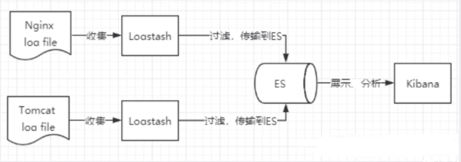


# 四、ElasticSearch核心概念

1、索引（ElasticSearch）：包多个分片

2、字段类型（mapping 映射）：字段类型映射（字段是整型，还是字符型…）

3、文档（documents）

4、分片（Lucene索引，倒排索引）


## 概述

在前面的学习中，我们已经掌握了s是什么，同时也把es的服务已经安装启动，那么es是如何去存储数据，数据结构是什么，又是如何实现搜索的呢？我们先来聊聊ElasticSearch的相关概念吧！


<font color=red>集群，节点，索引，类型，文档，分片，映射是什么？</font>


> ElasticSearch**是面向文档**，关系行数据库和ElasticSearch客观对比！一切都是JSON！

| Relational DB      | ElasticSearch               |
| ------------------ | --------------------------- |
| 数据库（database） | 索引（indices）             |
| 表（tables）       | 类型 types \<慢慢会被弃用!> |
| 行（rows）         | 文档 documents              |
| 字段（columns）    | fields                      |

**elasticsearch（集群）**中可以包含多个**索引（数据库）** ，每个索引中可以包含多个**类型（表）** ，每个类型下又包含多个**文档（行）** ，每个文档中又包含多个**字段（列）**。


### 物理设计

elasticsearch 在后台把**每个索引划分成多个分片**，每分分片可以在集群中的不同服务器间迁移

一个人就是一个集群! ，即**启动的ElasticSearch服务，默认就是一个集群，且默认集群名为elasticsearch**

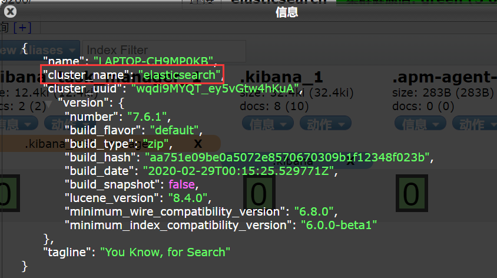


### 逻辑设计

一个索引类型中，包含多个文档，比如说文档1，文档2。当我们索引一篇文档时，可以通过这样的顺序找到它：索引 => 类型 => 文档ID ，通过这个组合我们就能索引到某个具体的文档。 注意：ID不必是整数，实际上它是个字符串。


> #### 文档（”类比一条条数据行“）

文档就是我们的一条条数据


之前说elasticsearch是面向文档的，那么就意味着**索引和搜索数据的最小单位是文档**，elasticsearch中，文档有几个重要属性:

- 自我包含，一篇文档同时包含字段和对应的值，也就是同时包含key:value !
- 可以是层次型的，一个文档中包含自文档，复杂的逻辑实体就是这么来的! {就是一个json对象 ! fastjson进行自动转换 !}
- 灵活的结构，文档不依赖预先定义的模式，我们知道关系型数据库中，要提前定义字段才能使用，在elasticsearch中，对于字段是非常灵活的，有时候，我们可以忽略该字段，或者动态的添加一个新的字段。


尽管我们可以随意的新增或者忽略某个字段，但是，每个字段的类型非常重要，比如一个年龄字段类型，可以是字符串也可以是整形。因为elasticsearch会保存字段和类型之间的映射及其他的设置。这种映射具体到每个映射的每种类型，这也是为什么在elasticsearch中，类型有时候也称为映射类型。


> #### 类型（“类比字段类型”）

类型是文档的逻辑容器，就像关系型数据库一样，表格是行的容器。类型中对于字段的定义称为映射，比如name映射为字符串类型。我们说文档是无模式的，它们不需要拥有映射中所定义的所有字段，比如新增一个字段，那么elasticsearch是怎么做的呢?

- elasticsearch会自动的将新字段加入映射，但是这个字段的不确定它是什么类型，elasticsearch就开始猜，如果这个值是18，那么elasticsearch会认为它是整形。但是elasticsearch也可能猜不对，所以最安全的方式就是提前定义好所需要的映射，这点跟关系型数据库殊途同归了，先定义好字段，然后再使用，别整什么幺蛾子。


> #### 索引（“类比数据库”）

索引是映射类型的容器， elasticsearch中的索引是一个非常大的文档集合。 索引存储了映射类型的字段和其他设置。然后它们被存储到了各个分片上了。我们来研究下分片是如何工作的。


**物理设计：节点和分片 如何工作**

创建新索引


一个集群至少有一个节点，而一个节点就是一个elasricsearch进程，节点可以有多个索引默认的，如果你创建索引，那么索引将会有个5个分片**(primary shard ，又称主分片)**构成的，每一个主分片会有一个副本**(replica shard，又称复制分片)**

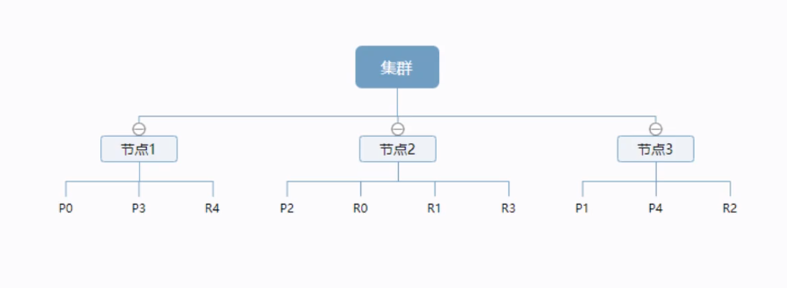


上图是一个有3个节点的集群，可以看到主分片和对应的复制分片都不会在同一个节点内，这样有利于某个节点挂掉了，数据也不至于失。实际上，**一个分片是一个Lucene索引（<mark>一个ElasticSearch索引包含多个Lucene索引</mark>）** ，**一个包含<font color=red>倒排索引</font>的文件目录，倒排索引的结构使得elasticsearch在不扫描全部文档的情况下，就能告诉你哪些文档包含特定的关键字**。不过，等等，倒排索引是什么鬼?


**倒排索引（Lucene索引底层）**

elasticsearch使用的是一种称为倒排索引的结构，采用Lucene倒排索作为底层。这种结构适用于快速的全文搜索，**一个索引由文档中所有不重复的列表构成，对于每一个词，都有一个包含它的文档列表。**例如，现在有两个文档，每个文档包含如下内容：

```tex
Study every day, good good up to forever # 文档l包含的内容
To forever, study every day, good good up  # 文档2包含的内容
```

为了创建倒排索引，我们首先要将每个文档拆分成独立的词（或称为词条或者tokens)，然后创建一个包含所有不重复的词条的排序列表，然后列出每个词条出现在哪个文档：

| term    | doc_1 | doc_2 |
| ------- | ----- | ----- |
| Study   | ✅     | x     |
| To      | x     | ✅     |
| every   | ✅     | ✅     |
| forever | ✅     | ✅     |
| day     | ✅     | ✅     |
| study   | x     | ✅     |
| good    | ✅     | ✅     |
| to      | ✅     | x     |
| up      | ✅     | ✅     |


现在，我们试图搜索to forever，只需要查看包含每个词条的文档

| term    | doc_1 | doc_2 |
| ------- | ----- | ----- |
| to      | ✅     | x     |
| forever | ✅     | ✅     |
| total   | 2     | 1     |

两个文档都匹配，但是第一个文档比第二个匹配程度更高。如果没有别的条件，现在，这两个包含关键字的文档都将返回。


再来看一个示例，比如我们通过博客标签来搜索博客文章。那么倒排索引列表就是这样的一个结构：

> 简单说就是 按（文章关键字，对应的文档\<0个或多个\>）形式建立索引，根据关键字就可直接查询对应的文档（含关键字的），无需查询每一个文档，如下图


如果要搜索含有 python 标签的文章，那相对于查找所有原始数据而言，查找倒排索引后的数据将会快的多。只需要查看标签这一栏，然后获取相关的文章ID即可。倒排索引完全过滤掉无关的所有数据，提高效率！


**elasticsearch的索引和Lucene的索引对比**

在elasticsearch中，索引（库）这个词被频繁使用，这就是术语的使用。在elasticsearch中，索引被分为多个分片，每份分片是一个

Lucene的索引。**所以一个elasticsearch索引是由多个Lucene索引组成的**。别问为什么，谁让elasticsearch使用Lucene作为底层呢！ 如无特指，说起索引都是指elasticsearch的索引。

接下来的一切操作都在kibana中Dev Tools下的Console里完成。基础操作！


# 五、IK分词器(elasticsearch插件)

> **什么是IK分词器：中文分词器**

分词：即把一段中文或者别的划分成一个个的关键字，我们在搜索时候会**把自己**的信息进行分词，会把数据库中或者索引库中的数据进行分词，然后进行一一个匹配操作，**默认的中文分词是将每个字看成一个词**（<mark>不使用用IK分词器的情况下</mark>），比如“我爱狂神”会被分为”我”，”爱”，”狂”，”神” ，这显然是不符合要求的，所以我们需要安装中文分词器ik来解决这个问题。


如果要使用中文，建议使用k分词器！


**IK提供了两个分词算法**: `ik_smart`和`ik_max_word` ，其中`ik_smart`为**最少切分**， `ik_max_word`为**最细粒度划分**!


### 1、下载

> 版本要与ElasticSearch版本对应（7.6.1）

下载地址：https://github.com/medcl/elasticsearch-analysis-ik/releases

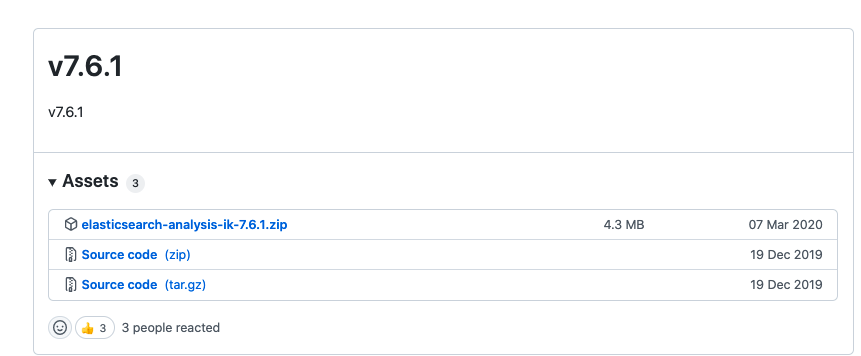

### 2、安装

> ik文件夹是自己创建的

解压即可（但是我们需要解压到ElasticSearch的plugins目录ik文件夹下）

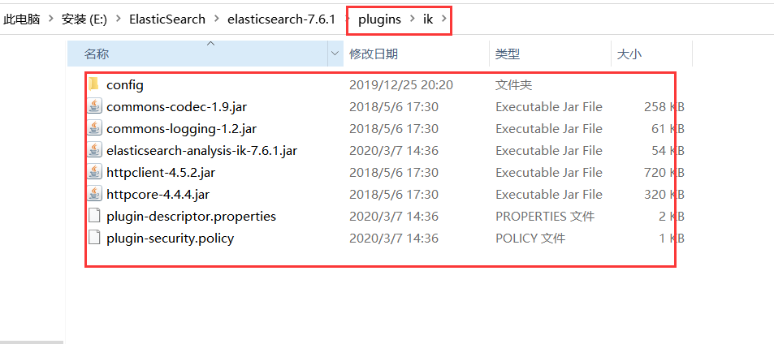 


### 3、重启ElasticSearch

> 加载了IK分词器

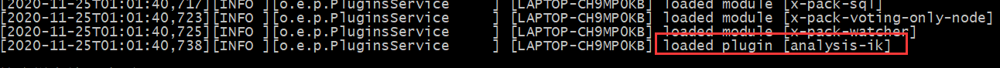

### 4、使用 `ElasticSearch安装补录/bin/elasticsearch-plugin` 可以查看插件

```shell
E:\ElasticSearch\elasticsearch-7.6.1\bin>elasticsearch-plugin list
```

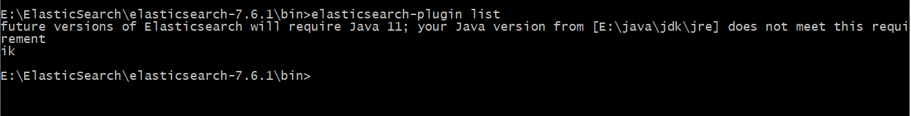

### 5、使用kibana测试

`ik_smart`：最少切分

```json
GET _analyze
{
 "analyzer": "ik_smart",
 "text": "年轻人不讲武德"
}
```


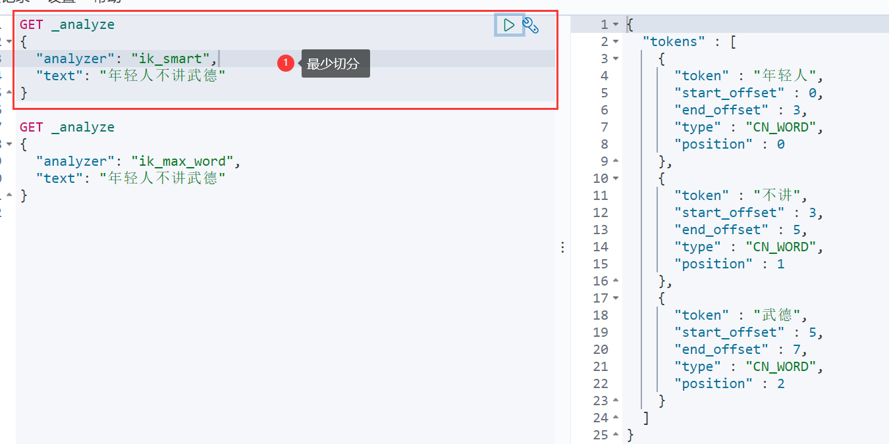


`ik_max_word`：最细粒度划分（穷尽词库的可能）

```json
GET _analyze
{
 "analyzer": "ik_max_word",
 "text": "年轻人不讲武德"
}
```


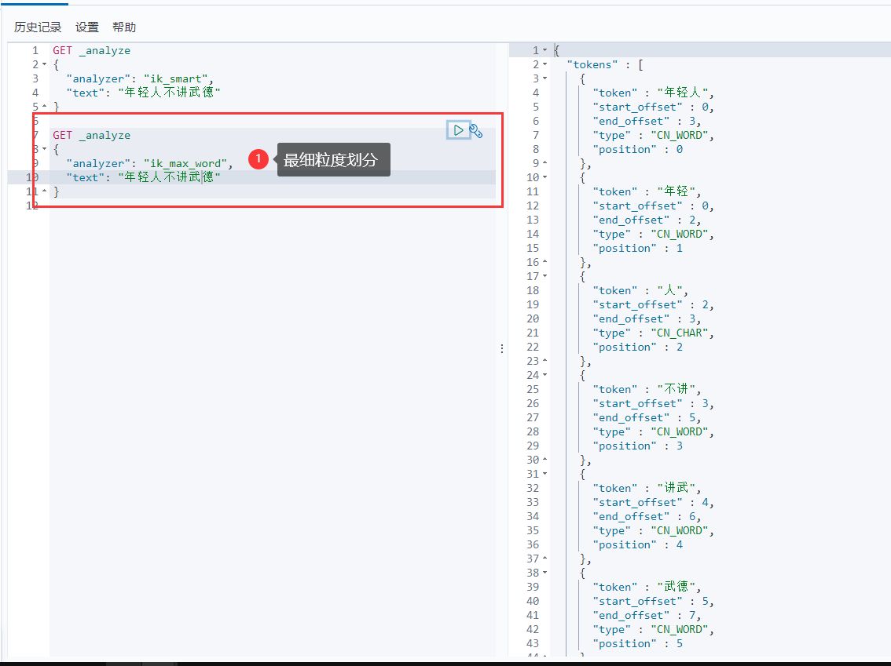


从上面看，感觉分词都比较正常，但是大多数，分词都满足不了我们的想法，如下例

```json
GET _analyze
{
 "analyzer": "ik_smart",
 "text": "你们耗子尾汁"
}


GET _analyze
{
 "analyzer": "ik_max_word",
 "text": "你们耗子尾汁"
}
```


那么，我们需要手动将该词添加到分词器的词典当中


### 6、添加自定义的词添加到扩展字典中

```shell
elasticsearch目录/plugins/ik/config/IKAnalyzer.cfg.xml
```

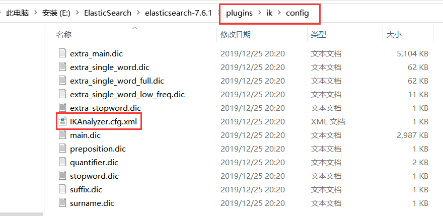


打开 `IKAnalyzer.cfg.xml` 文件，扩展字典


创建字典文件，添加字典内容


重启ElasticSearch，再次使用kibana测试

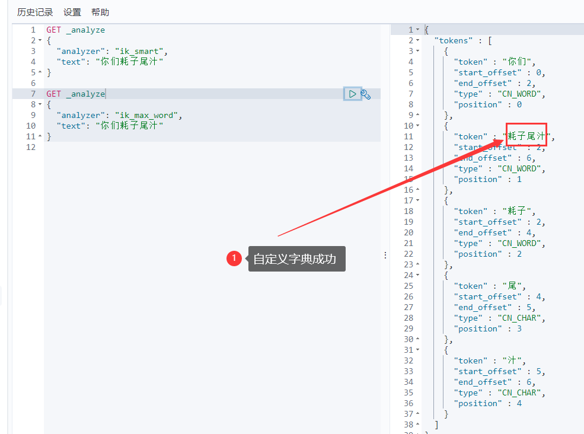

以后的话，我们需要自己配置分词就在自己定义的dic文件中进行配置即可！


# 六、Rest风格说明

**一种软件架构风格**，而不是标准，只是提供了一组设计原则和约束条件。它主要用于客户端和服务器交互类的软件。基于这个风格设计的软件可以**更简洁**，**更有层次**，**更易于实现缓存**等机制。

### **基本Rest命令说明：**

| method            | url地址                                                      | 描述                   |
| :---------------- | :----------------------------------------------------------- | :--------------------- |
| PUT（创建，修改） | localhost:9200/索引名称/类型名称/文档id                      | 创建文档（指定文档id） |
| POST（创建）      | localhost:9200/索引名称/类型名称                             | 创建文档（随机文档id） |
| POST（修改）      | localhost:9200/索引名称/类型名称/文档id/_update <br>localhost:9200/索引名称/类型名称/_update/文档id | 修改文档               |
| DELETE（删除）    | localhost:9200/索引名称/类型名称/文档id                      | 删除文档               |
| GET（查询）       | localhost:9200/索引名称/类型名称/文档id                      | 查询文档通过文档ID     |
| POST（查询）      | localhost:9200/索引名称/类型名称/文档id/_search              | 查询所有数据           |


### 基础测试

#### 1、创建一个索引（同时添加数据）

```json
PUT /test1/type1/1
{
  "name" : "流柚",
  "age" : 18
}


PUT /索引名/类型名/文档id
{
  请求体
}
```


完成了自动增加了索引！数据也成功的添加了，这就是我说大家在初期可以把它当做数据库学习的原因！


那么name这个字段用不用指定类型呢。毕竟我们关系型数据库是需要指定类型的啊！


#### 2、字段数据类型

- 字符串类型

  - text、keyword

    - text：支持分词，全文检索，支持模糊、精确查询，不支持聚合，排序操作;text类型的最大支持的字符长度无限制，适合大字段存储；
  - keyword：不进行分词，直接索引、支持模糊、支持精确匹配，支持聚合、排序操作。keyword类型的最大支持的长度为—32766个UTF-8类型的字符，可以通过设置ignore_above指定自持字符长度，超过给定长度后的数据将不被索引，无法通过term精确匹配检索返回结果。
  
- 数值型

  - long、Integer、short、byte、double、float、**half float**、**scaled float**

- 日期类型

  - date

- te布尔类型

  - boolean

- 二进制类型

  - binary

- 等等…

  

#### 3、指定字段的类型（使用PUT）

> 类似于建库（建立索引和字段对应类型），也可看做规则的建立

```json
PUT /test2
{
  "mappings": {
    "properties": {
      "name": {
        "type": "text"
      },
      "age": {
        "type": "long"
      },
      "birthday": {
        "type": "date"
      }
    }
  }
}
```

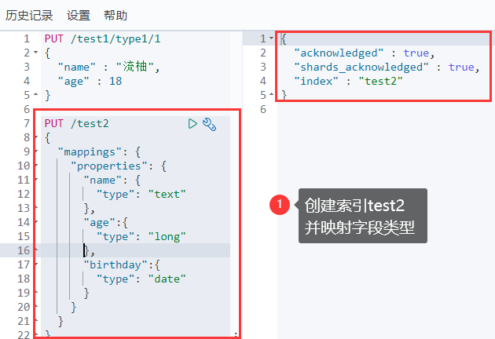


#### 4、获取建立的规则

```json
GET test2
```

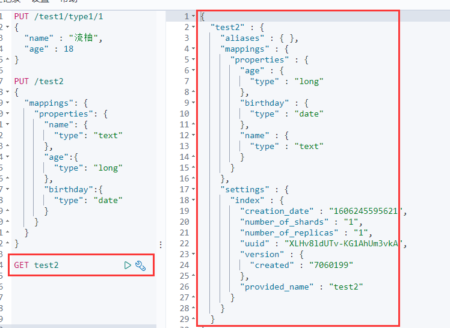

#### 5、获取默认信息

> `_doc` 默认类型（default type），type 在未来的版本中会逐渐弃用，因此产生一个默认类型进行代替

```json
PUT /test3/_doc/1
{
  "name": "流柚",
  "age": 18,
  "birth": "1999-10-10"
} 

GET test3
```

如果自己的文档字段没有被指定，那么ElasticSearch就会给我们默认配置字段类型

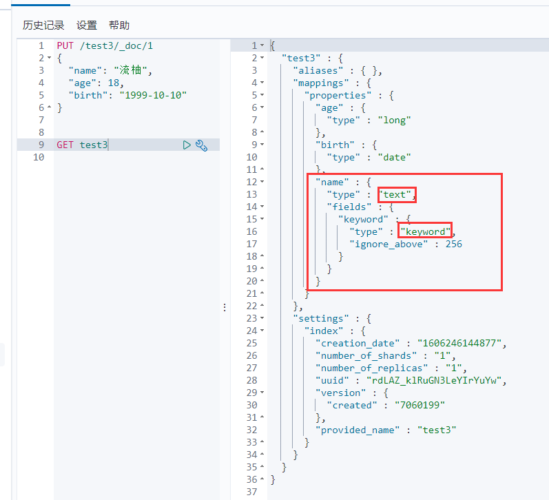


#### 6、**扩展：通过`get _cat/` 可以获取ElasticSearch的当前的很多信息！**

```shell
GET _cat/indices
GET _cat/aliases
GET _cat/allocation
GET _cat/count
GET _cat/fielddata
GET _cat/health
GET _cat/indices
GET _cat/master
GET _cat/nodeattrs
GET _cat/nodes
GET _cat/pending_tasks
GET _cat/plugins
GET _cat/recovery
GET _cat/repositories
GET _cat/segments
GET _cat/shards
GET _cat/snapshots
GET _cat/tasks
GET _cat/templates
GET _cat/thread_pool
```


比如查看索引信息 GET _cat/indices?v

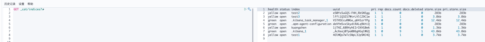


#### 7、修改数据两种方案

##### ①使用put方案修改数据，会覆盖原来的值

- 版本+1（_version）
- 但是如果漏掉某个字段没有写，那么更新是没有写的字段 ，会消失

```json
PUT /test3/_doc/1
{
  "name": "流柚是我大哥",
  "age": 18,
  "birth": "1999-10-10"
} 

GET /test3/_doc/1

// 漏掉一些字段，修改会有字段丢失
PUT /test3/_doc/1
{
  "name" : "流柚"
}
GET /test3/_doc/1
```


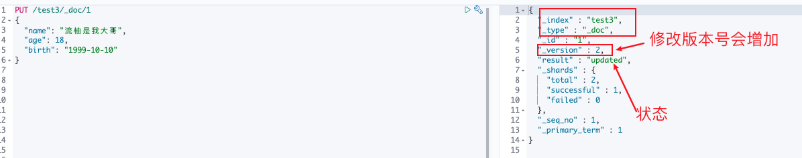


漏掉一些字段，修改会有字段丢失


##### ②推荐使用（使用post的update），可以更新部分字段

- 需要注意doc
- 不会丢失字段，可以实现部分字段更新

```json
POST /test3/_doc/1/_update
{
  "doc":{
    "name" : "post修改测试",
    "age" : 2
  }
}

# 推荐格式 /index/_update/{id}
POST /test3/_update/1
{
  "doc": {
    "name": "post修改测试"
  }
}

GET /test3/_doc/1
```


#### 8、删除

通过ELETE命令实现删除、根据你的请求来判断是删除索引还是删除文档记录！

```shell
GET /test1

# 删除索引
DELETE /test1

# 删除文档记录
DELETE /test1/_doc/1
```

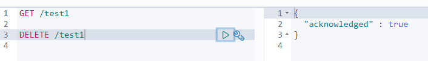

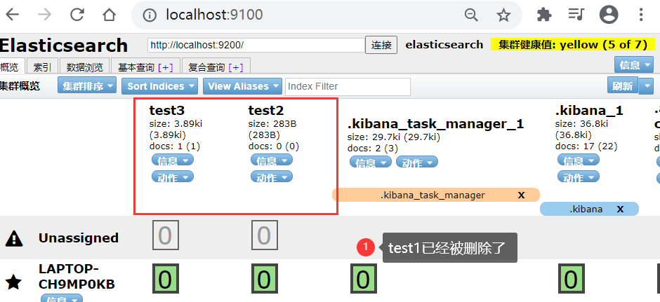

#### 9、查询（简单条件）

```shell
PUT /kuangshen/user/3
{
  "name":"李四",
  "age":30,
  "desc":"mmp, 不知道如何形容",
  "tags":["靓女","旅游","唱歌"]
}


# 简单查询数据，根据id查询  GET /索引/类型/文档id
GET /kuangshen/user/3

# 精确匹配
GET /kuangshen/user/_search?q=name:李四
GET /test3/_doc/_search?q=name:流柚
```

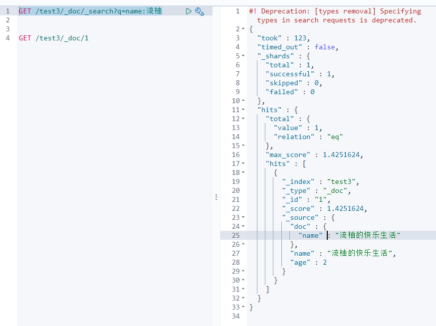


关于分数说明

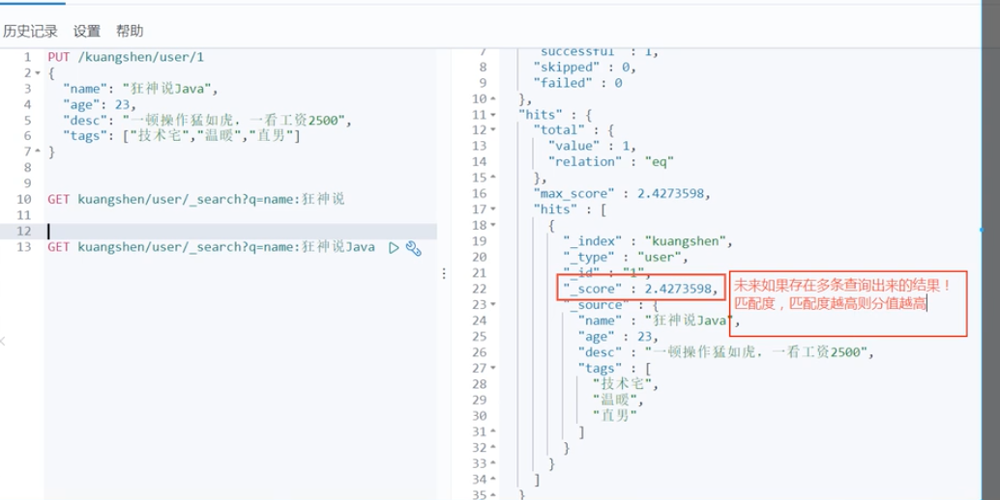


#### 10、复杂查询

高级复杂查询：排序、分页、高亮、模糊查询、精准查询


准备数据


> kuangshen索引中的内容

```json
PUT /kuangshen/user/1
{
  "name":"狂神说java",
  "age":23,
  "desc":"一顿操作猛如虎，一看工资2500",
  "tags":["技术宅","温暖","直男"]
}


PUT /kuangshen/user/2
{
  "name":"张三",
  "age":3,
  "desc":"法外狂徒",
  "tags":["交友","旅游","渣男"]
}


PUT /kuangshen/user/3
{
  "name":"李四",
  "age":23,
  "desc":"mmp，不知道怎么形容",
  "tags":["靓女","旅游","唱歌"]
}

PUT /kuangshen/user/4
{
  "name":"狂神说前端",
  "age":23,
  "desc":"mmp，不知道怎么形容",
  "tags":["靓女","旅游","唱歌"]
}
```


> blog 索引中的内容

```json

PUT /blog/user/1
{
  "name":"流柚",
  "age":3,
  "desc":["阳关大男孩","乐于助人","年轻"]
}

PUT /blog/user/2
{
  "name":"刘民锴",
  "age":18,
  "desc":["心机boy","牛角尖","糊涂"]
}


PUT /blog/user/3
{
  "name":"马老师",
  "age":18,
  "desc":["三德：口德、手德、头德","年轻人不讲武德","老同志"]
}
```


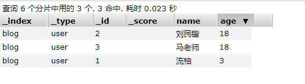


##### ①查询匹配

- `match`：匹配（会使用分词器解析（先分析文档，然后进行查询））
- `_source`：过滤字段
- `sort`：排序
- `form`、`size` 分页


```json
GET /kuangshen/_search
{
  "query": {
    "match": {
      "name": "狂神"
    }
  }
}
```


hits：

是索引和文栏的信息查询的结果总数

然后就是查询出来的具体的文档数据中的东西，都可遍历出来

分数：我们可以通过来判断谁更加更加符合结果

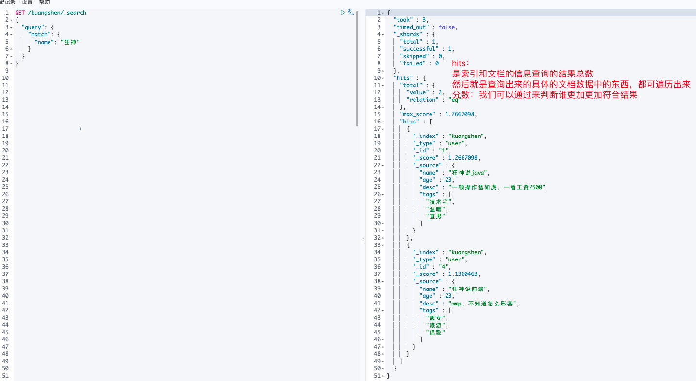


```json
// 查询匹配
GET /kuangshen/_search
{
  "query": {
    "match": {
      "name": "狂神"
    }
  },
  "_source": [
    "name",
    "desc"
  ],
  "sort": [
    {
      "age": {
        "order": "desc"
      }
    }
  ],
  "from": 0,
  "size": 1
}
```


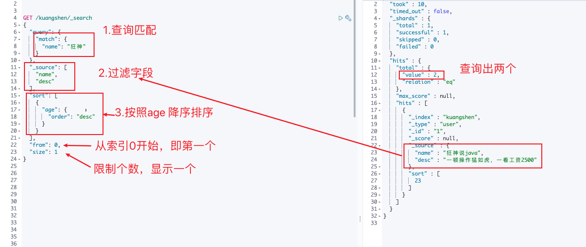


##### ②多条件查询（bool）

- `must` 相当于 `and`
- `should` 相当于 `or`
- `must_not` 相当于 `not (... and ...)`
- `filter` 过滤，比如支持范围查询

```json
// bool 多条件查询，内部组合多种条件
// must <==> and  所有的条件都要符合
// should <==> or  条件中满足其一即可
// must_not <==> not (... and ...)
// filter数据过滤，可以支持范围查询
// boost
// minimum_should_match
GET /blog/user/_search
{
  "query":{
    "bool": {
      "must": [
        {
          "match":{
            "age":3
          }
        },
        {
          "match": {
            "name": "流"
          }
        }
      ],
      "filter": {
        "range": {
          "age": {
            "gte": 1,
            "lte": 3
          }
        }
      }
    }
  }
}
```


##### ③匹配数组

- 貌似不能与其它字段一起使用
- 可以多关键字查（空格隔开）— 匹配字段也是符合的
- `match` 会使用分词器解析（先分析文档，然后进行查询）
- 搜词

```json
// 匹配数组 貌似不能与其它字段一起使用
// 可以多关键字查（空格隔开）
// match 会使用分词器解析（先分析文档，然后进行查询）
GET /blog/user/_search
{
  "query":{
    "match":{
      "desc":"年龄 牛 大"
    }
  }
}
```


分值越高，越排在前面


##### ④精确查询

term查询是直接通过倒排索引指定的词条进程精确查找的！

- `term` 直接通过 倒排索引 指定**词条**查询
- 适合查询 number、date、keyword ，不适合text


关于分词：

- term，直接查询精确的，

- match，会使用分词器解析（先分析文档【先分词】，然后通过分析的文档进行查询）


```json
// 精确查询（必须全部都有，而且不可分，即按一个完整的词查询）
// term 直接通过 倒排索引 指定的词条 进行精确查找的
GET /blog/user/_search
{
  "query":{
    "term":{
      "desc":"年 "
    }
  }
}
```


##### ⑤text和keyword

- text：
  - **支持分词**，**全文检索**、支持模糊、精确查询，不支持聚合，排序操作;
  - text类型的最大支持的字符长度无限制，适合大字段存储；
- keyword：
  - **不进行分词**，**直接索引**、支持模糊、支持精确匹配，支持聚合、排序操作。
  - keyword类型的最大支持的长度为——32766个UTF-8类型的字符，可以通过设置ignore_above指定自持字符长度，超过给定长度后的数据将不被索引，**无法通过term精确匹配检索返回结果**。


```json
// 测试keyword和text是否支持分词
// 设置索引类型
PUT /test
{
  "mappings": {
    "properties": {
      "text": {
        "type": "text"
      },
      "keyword": {
        "type": "keyword"
      }
    }
  }
}

// 设置字段数据
PUT /test/_doc/1
{
  "text":"测试keyword和text是否支持分词",
  "keyword":"测试keyword和text是否支持分词"
}

```


没有被分词

```json
// 不会被分词，当做一个整体
GET _analyze
{
  "analyzer": "keyword",
  "text": "测试keyword和text是否支持分词"
}
```


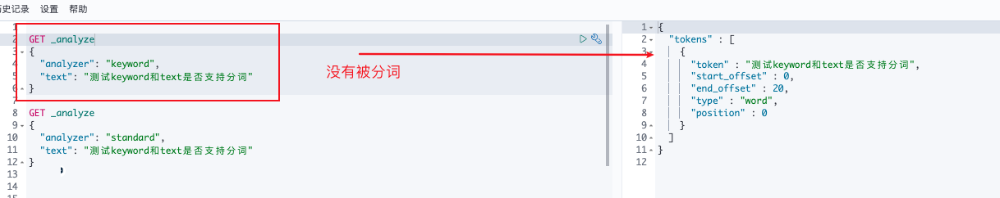


有被分词

```json
// 会被分词，可以看到被拆分了
GET _analyze
{
  "analyzer": "standard",
  "text": "测试keyword和text是否支持分词"
}
```

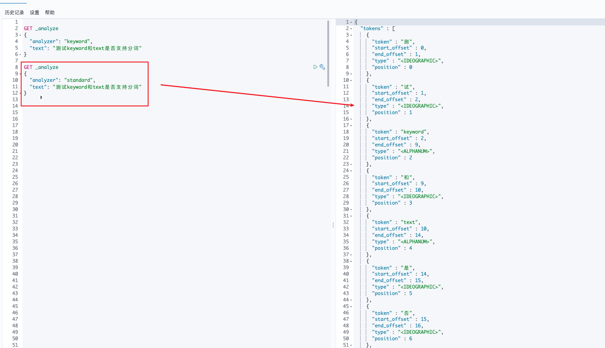


```json
// text 支持分词
// keyword 不支持分词
GET /test/_doc/_search
{
  "query":{
   "match":{
     "text":"测试"
   }
  }
}// 查的到


GET /test/_doc/_search
{
  "query":{
   "match":{
      "keyword":"测试"
   }
  }
}// 查不到，必须是 "测试keyword和text是否支持分词" 才能查到


GET _analyze
{
  "analyzer": "keyword"，
  "text": ["测试liu"]
}// 不会分词，即 测试liu


GET _analyze
{
  "analyzer": "standard"，
  "text": ["测试liu"]
}// 分为 测 试 liu


GET _analyze
{
  "analyzer":"ik_max_word"，
  "text": ["测试liu"]
}// 分为 测试 liu
```


>来自：Mr丶whale 的解答
>
>简单解释一下 text 、keyword、term、match
>text和keyword是数据类型，表示在创建的时候是否会分词建立索引。
>term和match是指查询时是否启用分词查询。
>
>
>
>例如：
>
>现在有一个数据 “my cat”是text类型。
>		那么，使用term查询“my cat”时，失败，因为“my cat”在被创建时分词器将其索引建立为“my”和“cat”。
>
>​		使用term查询“my”或“cat”时，则会成功，因为索引又能够精确匹配的数据。
>​		使用match查询“my cat”也能成功，因为match是模糊查询，查询语句“my cat”会被分词成为“my”和“cat”和“my cat”，只要有任意一个满足就会返回数据。
>
>如果“my cat”是keyword，那么建立时，只会有一个索引“my cat”
>		所以此时，不管是term还是match都只有查询“my cat”时才会返回数据，其余的都查询不到。


##### ⑥高亮查询

```json
// 高亮查询
GET blog/user/_search
{
  "query": {
    "match": {
      "name":"流"
    }
  }
  ，
  "highlight": {
    "fields": {
      "name": {}
    }
  }
}

// 自定义前缀和后缀
GET blog/user/_search
{
  "query": {
    "match": {
      "name":"流"
    }
  }
  ，
  "highlight": {
    "pre_tags": "<p class='key' style='color:red'>"，
    "post_tags": "</p>"， 
    "fields": {
      "name": {}
    }
  }
}
```

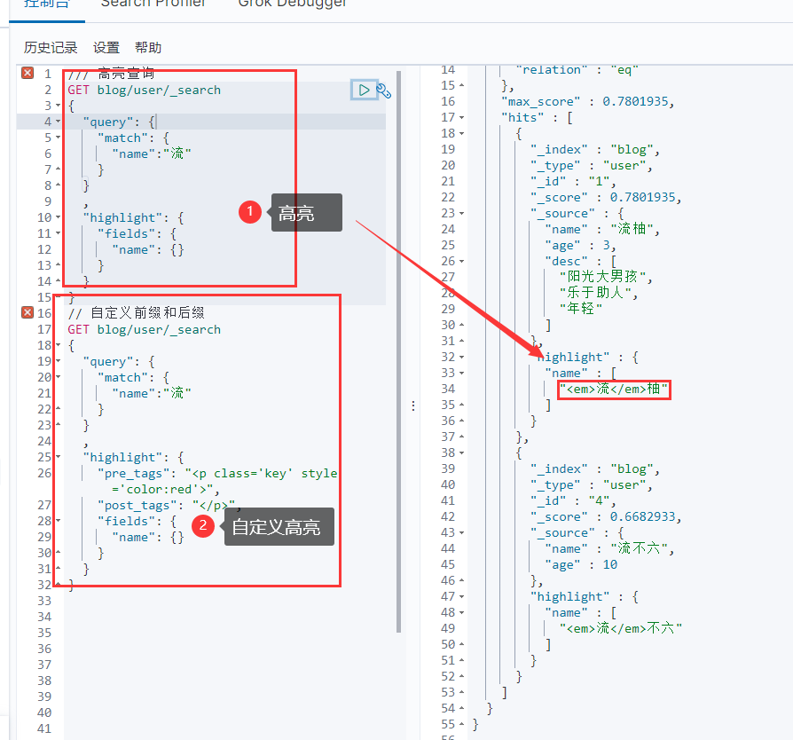


#### 11、聚合查询

```java
// 按照年龄进行分组，统计每个年龄的数量
GET /kuang_index/_search
{ 
  "aggs": {  // 聚合操作
    "age_group": { // 名称，随意起名
      "terms": { // 分组， 相当于sql中的group by
        "field": "age" // 分组字段
      }
    }
  },
  "size": 0 // 不返回原始数据
}


```


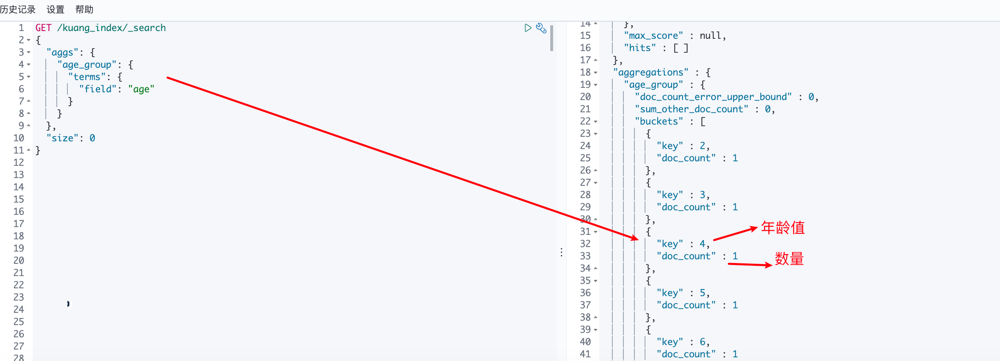


```json
// 求年龄的平均值
GET /kuang_index/_search
{ 
  "aggs": {  
    "age_avg": {
      "avg": { // 平均值
        "field": "age"
      }
    }
  },
  "size": 0
}
```


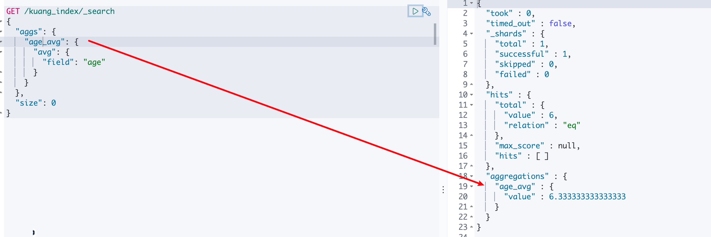


相关的聚合操作会提示

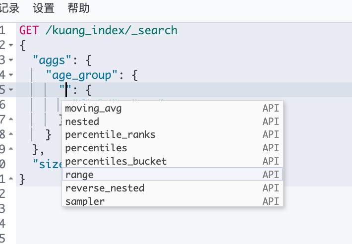


# 七、SpringBoot整合


### 1、关于Java客户端


官方文档说明：https://www.elastic.co/guide/index.html

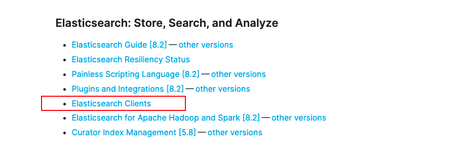

https://www.elastic.co/guide/en/elasticsearch/client/index.html

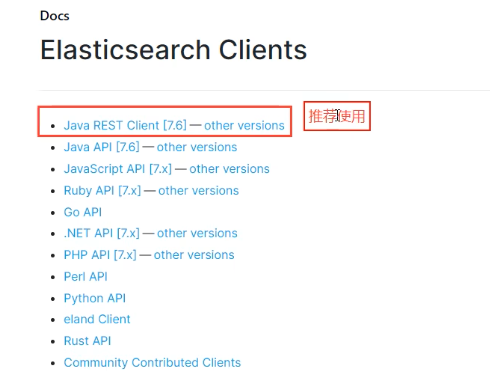

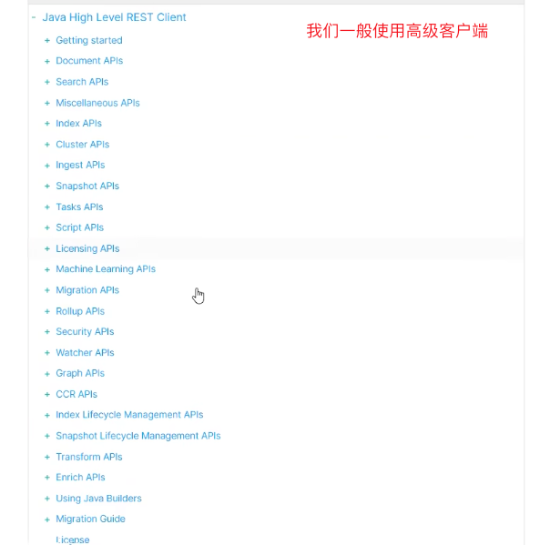


### 2、创建工程

略

**目录结构**

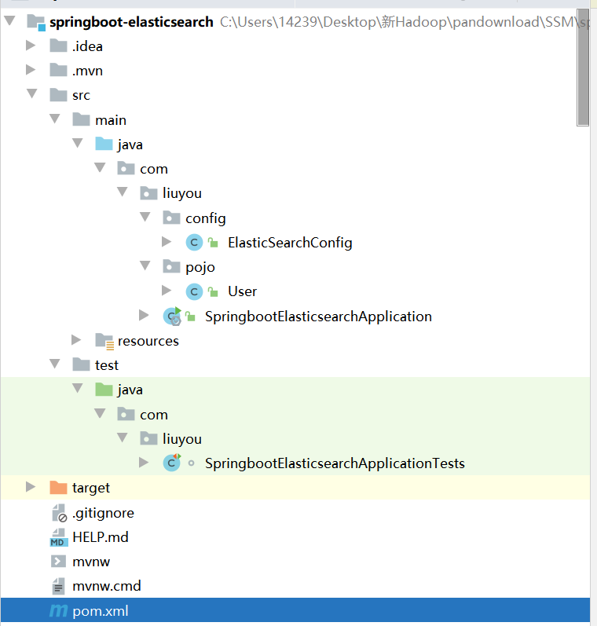

### 3、导入依赖

> 注意依赖版本和安装的版本一致

```xml
<properties>
    <java.version>1.8</java.version>
    <!-- 统一版本 -->
    <elasticsearch.version>7.6.1</elasticsearch.version>
</properties>
```

**导入elasticsearch**

```xml
<dependency>
    <groupId>org.springframework.boot</groupId>
    <artifactId>spring-boot-starter-data-elasticsearch</artifactId>
</dependency>
```

**提前导入fastjson、lombok**

```xml
<dependency>
    <groupId>com.alibaba</groupId>
    <artifactId>fastjson</artifactId>
    <version>1.2.70</version>
</dependency>
<!-- lombok需要安装插件 -->
<dependency>
    <groupId>org.projectlombok</groupId>
    <artifactId>lombok</artifactId>
    <optional>true</optional>
</dependency>
```


完整的依赖 pom.xml

```xml
<?xml version="1.0" encoding="UTF-8"?>
<project xmlns="http://maven.apache.org/POM/4.0.0"
         xmlns:xsi="http://www.w3.org/2001/XMLSchema-instance"
         xsi:schemaLocation="http://maven.apache.org/POM/4.0.0 http://maven.apache.org/xsd/maven-4.0.0.xsd">
    <modelVersion>4.0.0</modelVersion>

    <parent>
        <groupId>org.springframework.boot</groupId>
        <artifactId>spring-boot-starter-parent</artifactId>
        <version>2.2.5.RELEASE</version>
    </parent>

    <groupId>org.example</groupId>
    <artifactId>eleasticsearch-springboot-learn</artifactId>
    <version>1.0-SNAPSHOT</version>

    <properties>
        <maven.compiler.source>8</maven.compiler.source>
        <maven.compiler.target>8</maven.compiler.target>
        <elasticsearch.version>7.6.1</elasticsearch.version>
    </properties>

    <dependencies>
        <dependency>
            <groupId>org.springframework.boot</groupId>
            <artifactId>spring-boot-starter-data-elasticsearch</artifactId>
        </dependency>

        <dependency>
            <groupId>org.springframework.boot</groupId>
            <artifactId>spring-boot-starter-web</artifactId>
        </dependency>

        <dependency>
            <groupId>org.springframework.boot</groupId>
            <artifactId>spring-boot-devtools</artifactId>
            <scope>runtime</scope>
            <optional>true</optional>
        </dependency>

        <dependency>
            <groupId>org.springframework.boot</groupId>
            <artifactId>spring-boot-configuration-processor</artifactId>
            <optional>true</optional>
        </dependency>

        <dependency>
            <groupId>org.springframework.boot</groupId>
            <artifactId>spring-boot-starter-test</artifactId>
        </dependency>


        <dependency>
            <groupId>com.alibaba</groupId>
            <artifactId>fastjson</artifactId>
            <version>1.2.70</version>
        </dependency>
        <!-- lombok需要安装插件 -->
        <dependency>
            <groupId>org.projectlombok</groupId>
            <artifactId>lombok</artifactId>
            <optional>true</optional>
        </dependency>
    </dependencies>

    <build>
        <plugins>
            <!--打jar包插件-->
            <plugin>
                <groupId>org.springframework.boot</groupId>
                <artifactId>spring-boot-maven-plugin</artifactId>
            </plugin>
        </plugins>
    </build>


</project>

```


### 4、创建并编写配置类

```java
package com.caojx.learn.config;

import org.apache.http.HttpHost;
import org.elasticsearch.client.RestClient;
import org.elasticsearch.client.RestHighLevelClient;
import org.springframework.context.annotation.Bean;
import org.springframework.context.annotation.Configuration;

/**
 * 配置类
 *
 * @author caojx created on 2022/6/19 9:40 PM
 */
@Configuration
public class ElasticSearchConfig {

    // 注册 rest高级客户端
    @Bean
    public RestHighLevelClient restHighLevelClient() {
        RestHighLevelClient client = new RestHighLevelClient(RestClient.builder(new HttpHost("127.0.0.1", 9200, "http")));
        return client;
    }
}

```

### 5、创建并编写实体类

```java
package com.caojx.learn.pojo;

import lombok.AllArgsConstructor;
import lombok.Data;
import lombok.NoArgsConstructor;

import java.io.Serializable;

/**
 * 用户实体
 *
 * @author caojx created on 2022/6/19 9:42 PM
 */
@Data
@NoArgsConstructor
@AllArgsConstructor
public class User implements Serializable {
    private String name;
    private Integer age;
}

```


### 6、源码中的相关对象

spring-boot-autoconfigure-2.2.5.RELEASE.jar

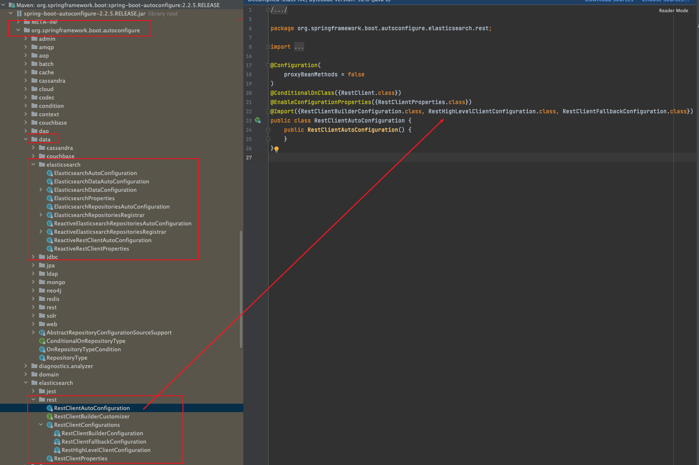


想要了解源码看下边相关的类即可

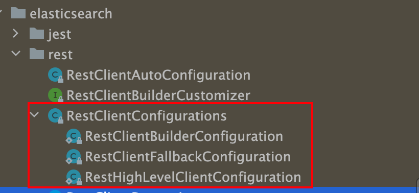


### 7、具体测试

> 所有测试均在 `SpringbootElasticsearchApplicationTests`中编写

#### 注入 `RestHighLevelClient`

```java
@Autowired
public RestHighLevelClient restHighLevelClient;
```

#### 索引的操作

##### 1、索引的创建

```java
package com.caojx.learn;

import org.elasticsearch.client.RequestOptions;
import org.elasticsearch.client.RestHighLevelClient;
import org.elasticsearch.client.indices.CreateIndexRequest;
import org.elasticsearch.client.indices.CreateIndexResponse;
import org.junit.jupiter.api.Test;
import org.springframework.beans.factory.annotation.Autowired;
import org.springframework.boot.test.context.SpringBootTest;

import java.io.IOException;

/**
 * es 7.6.x 高级客户端API 测试
 *
 * @author caojx created on 2022/6/19 9:44 PM
 */
@SpringBootTest
public class SpringbootElasticsearchApplicationTests {

    @Autowired
    public RestHighLevelClient restHighLevelClient;

    // 测试索引的创建， Request PUT kuang_index
    @Test
    public void testCreateIndex() throws IOException {
        // 创建缩索引请求
        CreateIndexRequest request = new CreateIndexRequest("kuang_index");
        // 客户端执行请求，请求后获得响应
        CreateIndexResponse response = restHighLevelClient.indices().create(request, RequestOptions.DEFAULT);
        System.out.println(response.isAcknowledged());// 查看是否创建成功
        System.out.println(response);// 查看返回对象
        restHighLevelClient.close();
    }
}

```

##### 2、索引的获取，并判断其是否存在

```java
// 测试获取索引，并判断其是否存在
@Test
public void testIndexIsExists() throws IOException {
    GetIndexRequest request = new GetIndexRequest("kuang_index");
    boolean exists = restHighLevelClient.indices().exists(request, RequestOptions.DEFAULT);
    System.out.println(exists);// 索引是否存在
    restHighLevelClient.close();
}
```

##### 3、索引的删除

```java
// 测试索引删除
@Test
public void testDeleteIndex() throws IOException {
    DeleteIndexRequest request = new DeleteIndexRequest("kuang_index");
    AcknowledgedResponse response = restHighLevelClient.indices().delete(request， RequestOptions.DEFAULT);
    System.out.println(response.isAcknowledged());// 是否删除成功
    restHighLevelClient.close();
}
```

#### 文档的操作

##### 1、文档的添加

```java
// 测试添加文档(先创建一个User实体类，添加fastjson依赖)
@Test
public void testAddDocument() throws IOException {
    // 创建一个User对象
    User user = new User("狂神说", 18);

    // 创建请求
    IndexRequest request = new IndexRequest("kuang_index");

    // 制定规则 PUT /kuang_index/_doc/1
    request.id("1");// 设置文档ID
    request.timeout(TimeValue.timeValueMillis(1000)); // request.timeout("1s")
    // 将我们的数据放入请求中
    request.source(JSON.toJSONString(user), XContentType.JSON);

    // 客户端发送请求，获取响应的结果
    IndexResponse response = restHighLevelClient.index(request, RequestOptions.DEFAULT);

    System.out.println(response.status()); // 获取建立索引的状态信息 CREATED
    System.out.println(response); // 查看返回内容 IndexResponse[index=kuang_index,type=_doc,id=1,version=1,result=created,seqNo=0,primaryTerm=1,shards={"total":2,"successful":1,"failed":0}]
}
```

##### 2、文档信息的获取

```java
// 测试获得文档信息
@Test
public void testGetDocument() throws IOException {
    GetRequest request = new GetRequest("kuang_index"，"1");
    GetResponse response = restHighLevelClient.get(request, RequestOptions.DEFAULT);
    System.out.println(response.getSourceAsString());// 打印文档内容
    System.out.println(request);// 返回的全部内容和命令是一样的
    restHighLevelClient.close();
}
```

##### 3、文档的获取，并判断其是否存在

```java
// 获取文档，判断是否存在 get /kuang_index/_doc/1
@Test
public void testDocumentIsExists() throws IOException {
    GetRequest request = new GetRequest("kuang_index", "1");
    // 不获取返回的 _source的上下文了
    request.fetchSourceContext(new FetchSourceContext(false));
    request.storedFields("_none_");
    
    boolean exists = restHighLevelClient.exists(request, RequestOptions.DEFAULT);
    System.out.println(exists);
}
```

##### 4、文档的更新

```java
// 测试更新文档内容
@Test
public void testUpdateDocument() throws IOException {
    UpdateRequest request = new UpdateRequest("kuang_index", "1");
    request.timeout("1s");

    User user = new User("狂神说Java", 18);
    request.doc(JSON.toJSONString(user), XContentType.JSON);

    // 更新请求
    UpdateResponse response = restHighLevelClient.update(request, RequestOptions.DEFAULT);
    System.out.println(response.status()); // OK
    restHighLevelClient.close();
}
```

##### 5、文档的删除

```java
// 测试删除文档
@Test
public void testDeleteDocument() throws IOException {
    DeleteRequest request = new DeleteRequest("kuang_index","1");
    request.timeout("1s");
    DeleteResponse response = restHighLevelClient.delete(request, RequestOptions.DEFAULT);
    System.out.println(response.status());// OK
}
```


前面的操作都无法批量添加数据

```java
// 上面的这些api无法批量增加数据（只会保留最后一个source）
@Test
public void test() throws IOException {
    IndexRequest request = new IndexRequest("bulk");// 没有id会自动生成一个随机ID
    request.source(JSON.toJSONString(new User("liu"，1))，XContentType.JSON);
    request.source(JSON.toJSONString(new User("min"，2))，XContentType.JSON);
    request.source(JSON.toJSONString(new User("kai"，3))，XContentType.JSON);
    IndexResponse index = restHighLevelClient.index(request， RequestOptions.DEFAULT);
    System.out.println(index.status());// created
}
```


##### 6、批量添加数据

```java
// 特殊的，真的项目一般会 批量插入数据
@Test
public void testBulk() throws IOException {
    BulkRequest bulkRequest = new BulkRequest();
    bulkRequest.timeout("10s");

    ArrayList<User> users = new ArrayList<>();
    users.add(new User("kuangshen1", 1));
    users.add(new User("kuangshen2", 2));
    users.add(new User("kuangshen3", 3));
    users.add(new User("kuangshen4", 4));
    users.add(new User("kuangshen5", 5));
    users.add(new User("kuangshen6", 6));

    // 批量请求处理
    for (int i = 0; i < users.size(); i++) {
        bulkRequest.add(
                // 这里是数据信息
                new IndexRequest("kuang_index")
                        .id("" + (i + 1)) // 没有设置id 会自定生成一个随机id
                        .source(JSON.toJSONString(users.get(i)), XContentType.JSON)
        );
    }

    // 执行请求
    BulkResponse bulk = restHighLevelClient.bulk(bulkRequest, RequestOptions.DEFAULT);
    System.out.println(bulk.status());// ok
}
```


##### 7、文档的查询


```java
// 查询
// SearchRequest 搜索请求
// SearchSourceBuilder 条件构造
// HighlightBuilder 高亮
// TermQueryBuilder 精确查询
// MatchAllQueryBuilder
// xxxQueryBuilder ...
@Test
public void testSearch() throws IOException {
    // 1.创建查询请求对象
    SearchRequest searchRequest = new SearchRequest("kuang_index");
    // 2.构建搜索条件
    SearchSourceBuilder searchSourceBuilder = new SearchSourceBuilder();
    // (1)查询条件 使用QueryBuilders工具类创建
    // 精确查询
    // QueryBuilders.termQuery 精确
    TermQueryBuilder termQueryBuilder = QueryBuilders.termQuery("name", "kuangshen1");
    // 匹配所有
    // MatchAllQueryBuilder matchAllQueryBuilder = QueryBuilders.matchAllQuery();

    // (2)其他<可有可无>：（可以参考 SearchSourceBuilder 的字段部分）

    // 设置高亮
    searchSourceBuilder.highlighter(new HighlightBuilder());

    // 分页
    // searchSourceBuilder.from();
    // searchSourceBuilder.size();

    searchSourceBuilder.timeout(new TimeValue(60, TimeUnit.SECONDS));

    // (3)条件投入
    searchSourceBuilder.query(termQueryBuilder);

    // 3.添加条件到请求
    searchRequest.source(searchSourceBuilder);

    // 4.客户端查询请求
    SearchResponse search = restHighLevelClient.search(searchRequest, RequestOptions.DEFAULT);

    // 5.查看返回结果
    SearchHits hits = search.getHits();

    System.out.println(JSON.toJSONString(hits));
    System.out.println("=======================");
    for (SearchHit documentFields : hits.getHits()) {
        System.out.println(documentFields.getSourceAsMap());
    }
}
```


##### 8、聚合查询


```java
 // 文档聚合查询
    @Test
    public void testAggregation() throws IOException {
        // 1.创建查询请求对象
        SearchRequest request = new SearchRequest("kuang_index");

        // 2.构建聚合搜索条件
        SearchSourceBuilder builder = new SearchSourceBuilder();

        // 根据年龄进行聚合查询
        // 查询年龄的最大值
        AggregationBuilder aggregationBuilder = AggregationBuilders.max("maxAge").field("age");

        // AggregationBuilders.terms 相当于sql中的group by
//        AggregationBuilder aggregationBuilder = AggregationBuilders.terms("ageGroup").field("age");
        builder.aggregation(aggregationBuilder);


        // 3.添加条件到请求
        builder.timeout(new TimeValue(60, TimeUnit.SECONDS));
        request.source(builder);

        // 4.客户端查询请求
        SearchResponse response = restHighLevelClient.search(request, RequestOptions.DEFAULT);

        // 5.查看返回结果
        SearchHits hits = response.getHits();

        System.out.println(JSON.toJSONString(response.getAggregations()));
        System.out.println("=======================");
        for (SearchHit hit : hits) {
            System.out.println(hit.getSourceAsString());
        }
    }
```


# ElasticSearch实战

## 防京东商城搜索（高亮）

### 1、工程创建（springboot）

创建过程略

**目录结构**


### 2、基本编码

①导入依赖

```xml
<properties>
    <java.version>1.8</java.version>
    <elasticsearch.version>7.6.1</elasticsearch.version>
</properties>
<dependencies>
    <!-- jsoup解析页面 -->
    <!-- 解析网页 爬视频可 研究tiko -->
    <dependency>
        <groupId>org.jsoup</groupId>
        <artifactId>jsoup</artifactId>
        <version>1.10.2</version>
    </dependency>
    <!-- fastjson -->
    <dependency>
        <groupId>com.alibaba</groupId>
        <artifactId>fastjson</artifactId>
        <version>1.2.70</version>
    </dependency>
    <!-- ElasticSearch -->
    <dependency>
        <groupId>org.springframework.boot</groupId>
        <artifactId>spring-boot-starter-data-elasticsearch</artifactId>
    </dependency>
    <!-- thymeleaf -->
    <dependency>
        <groupId>org.springframework.boot</groupId>
        <artifactId>spring-boot-starter-thymeleaf</artifactId>
    </dependency>
    <!-- web -->
    <dependency>
        <groupId>org.springframework.boot</groupId>
        <artifactId>spring-boot-starter-web</artifactId>
    </dependency>
    <!-- devtools热部署 -->
    <dependency>
        <groupId>org.springframework.boot</groupId>
        <artifactId>spring-boot-devtools</artifactId>
        <scope>runtime</scope>
        <optional>true</optional>
    </dependency>
    <!--  -->
    <dependency>
        <groupId>org.springframework.boot</groupId>
        <artifactId>spring-boot-configuration-processor</artifactId>
        <optional>true</optional>
    </dependency>
    <!-- lombok 需要安装插件 -->
    <dependency>
        <groupId>org.projectlombok</groupId>
        <artifactId>lombok</artifactId>
        <optional>true</optional>
    </dependency>
    <!-- test -->
    <dependency>
        <groupId>org.springframework.boot</groupId>
        <artifactId>spring-boot-starter-test</artifactId>
        <scope>test</scope>
    </dependency>
</dependencies>
```

②导入前端素材

略

③编写 `application.preperties`配置文件

```properties
# 更改端口，防止冲突
server.port=9999
# 关闭thymeleaf缓存
spring.thymeleaf.cache=false

```


主启动

```java
package com.caojx.learn;

import org.springframework.boot.SpringApplication;
import org.springframework.boot.autoconfigure.SpringBootApplication;

/**
 * 防京东商城搜索
 *
 * @author caojx created on 2022/6/19 11:00 PM
 */
@SpringBootApplication
public class ElasticSearchJdApp {

    public static void main(String[] args) {
        SpringApplication.run(ElasticSearchJdApp.class, args);
    }
}

```


④测试controller和view

```java
@Controller
public class IndexController {
    @GetMapping("/index")
    public String index(){
        return "index";
    }
}
```


访问 localhost:9999


> 到这里可以先去编写爬虫，编写之后，回到这里

⑤编写Config

```java
@Configuration
public class ElasticSearchConfig {
    @Bean
    public RestHighLevelClient restHighLevelClient(){
        RestHighLevelClient client = new RestHighLevelClient(RestClient.builder(new HttpHost("127.0.0.1"，9200，"http")));
        return client;
    }
}
```

⑥编写service

> 因为是爬取的数据，那么就不走Dao，以下编写都不会编写接口，开发中必须严格要求编写

**ContentService**

```java
package com.caojx.learn.service;

import com.alibaba.fastjson.JSON;
import com.caojx.learn.pojo.Content;
import com.caojx.learn.utils.HtmlParseUtil;
import org.elasticsearch.action.bulk.BulkRequest;
import org.elasticsearch.action.bulk.BulkResponse;
import org.elasticsearch.action.index.IndexRequest;
import org.elasticsearch.action.search.SearchRequest;
import org.elasticsearch.action.search.SearchResponse;
import org.elasticsearch.client.RequestOptions;
import org.elasticsearch.client.RestHighLevelClient;
import org.elasticsearch.common.unit.TimeValue;
import org.elasticsearch.common.xcontent.XContentType;
import org.elasticsearch.index.query.QueryBuilders;
import org.elasticsearch.index.query.TermQueryBuilder;
import org.elasticsearch.search.SearchHit;
import org.elasticsearch.search.SearchHits;
import org.elasticsearch.search.builder.SearchSourceBuilder;
import org.springframework.beans.factory.annotation.Autowired;
import org.springframework.stereotype.Service;

import java.io.IOException;
import java.util.ArrayList;
import java.util.List;
import java.util.Map;
import java.util.concurrent.TimeUnit;

/**
 * @author caojx created on 2022/6/19 11:14 PM
 */
@Service
public class ContentService {
    @Autowired
    private RestHighLevelClient restHighLevelClient;

    // 1、解析数据放入 es 索引中
    public Boolean parseContent(String keyword) throws IOException {
        // 获取内容
        List<Content> contents = HtmlParseUtil.parseJD(keyword);
        // 内容放入 es 中
        BulkRequest bulkRequest = new BulkRequest();
        bulkRequest.timeout("2m"); // 可更具实际业务是指
        for (int i = 0; i < contents.size(); i++) {
            bulkRequest.add(
                    new IndexRequest("jd_goods")
                            .id("" + (i + 1))
                            .source(JSON.toJSONString(contents.get(i)), XContentType.JSON)
            );
        }
        BulkResponse bulk = restHighLevelClient.bulk(bulkRequest, RequestOptions.DEFAULT);
        restHighLevelClient.close();
        return !bulk.hasFailures();
    }

    // 2、根据keyword分页查询结果
    public List<Map<String, Object>> search(String keyword, Integer pageIndex, Integer pageSize) throws IOException {
        if (pageIndex < 0) {
            pageIndex = 0;
        }
        SearchRequest jd_goods = new SearchRequest("jd_goods");
        // 创建搜索源建造者对象
        SearchSourceBuilder searchSourceBuilder = new SearchSourceBuilder();
        // 条件采用：精确查询 通过keyword查字段name
        TermQueryBuilder termQueryBuilder = QueryBuilders.termQuery("name", keyword);
        searchSourceBuilder.query(termQueryBuilder);
        searchSourceBuilder.timeout(new TimeValue(60, TimeUnit.SECONDS));// 60s
        // 分页
        searchSourceBuilder.from(pageIndex);
        searchSourceBuilder.size(pageSize);
        // 高亮
        // ....
        // 搜索源放入搜索请求中
        jd_goods.source(searchSourceBuilder);
        // 执行查询,返回结果
        SearchResponse searchResponse = restHighLevelClient.search(jd_goods, RequestOptions.DEFAULT);
        restHighLevelClient.close();
        // 解析结果
        SearchHits hits = searchResponse.getHits();
        List<Map<String, Object>> results = new ArrayList<>();
        for (SearchHit documentFields : hits.getHits()) {
            Map<String, Object> sourceAsMap = documentFields.getSourceAsMap();
            results.add(sourceAsMap);
        }
        // 返回查询的结果
        return results;
    }
}


```

⑦编写controller

```java
@Controller
public class ContentController {
  
    @Autowired
    private ContentService contentService;
  
    @ResponseBody
    @GetMapping("/parse/{keyword}")
    public Boolean parse(@PathVariable("keyword") String keyword) throws IOException {
        return contentService.parseContent(keyword);
    }
  
    @ResponseBody
    @GetMapping("/search/{keyword}/{pageIndex}/{pageSize}")
    public List<Map<String, Object>> parse(@PathVariable("keyword") String keyword,
                                           @PathVariable("pageIndex") Integer pageIndex,
                                           @PathVariable("pageSize") Integer pageSize) throws IOException {
        return contentService.search(keyword, pageIndex, pageSize);
    }
}
```

⑧测试结果

1、解析数据放入 es 索引中

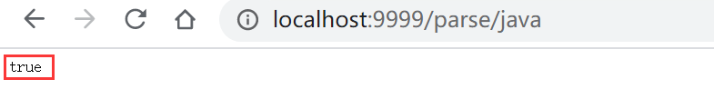

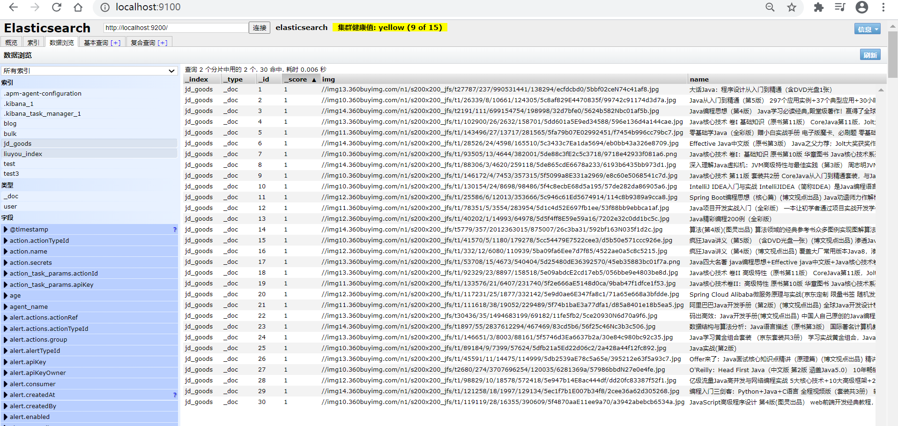

2、根据keyword分页查询结果


### 3、爬虫（jsoup）

> 数据获取：数据库、消息队列、爬虫、…

①搜索京东搜索页面，并分析页面 http://search.jd.com/search?keyword=java

页面如下


审查页面元素

**页面列表id：J_goodsList**

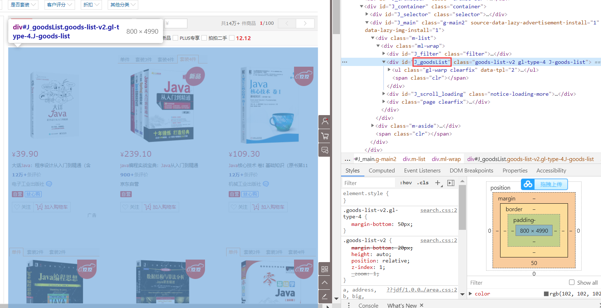  

**目标元素：img、price、name**

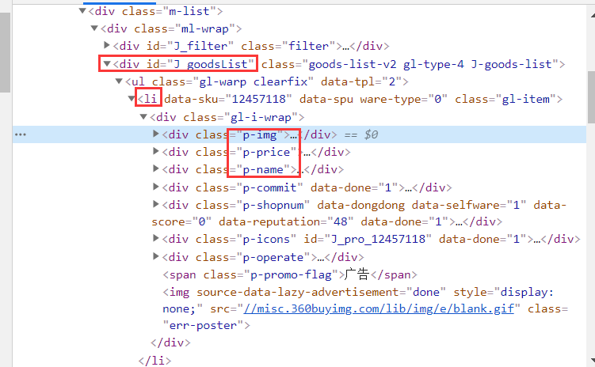

②爬取数据（获取请求返回的页面信息，筛选出可用的）

创建HtmlParseUtil，并简单编写

```java
public class HtmlParseUtil {
    public static void main(String[] args) throws IOException {
        /// 使用前需要联网
        // 请求url
        String url = "http://search.jd.com/search?keyword=java";
        // 1.解析网页(jsoup 解析返回的对象是浏览器Document对象)
        Document document = Jsoup.parse(new URL(url), 30000);
        // 使用document可以使用在js对document的所有操作
        // 2.获取元素（通过id）
        Element j_goodsList = document.getElementById("J_goodsList");
        // 3.获取J_goodsList ul 每一个 li
        Elements lis = j_goodsList.getElementsByTag("li");
        // 4.获取li下的 img、price、name
        for (Element li : lis) {
            String img = li.getElementsByTag("img").eq(0).attr("src");// 获取li下 第一张图片
            String name = li.getElementsByClass("p-name").eq(0).text();
            String price = li.getElementsByClass("p-price").eq(0).text();
            System.out.println("=======================");
            System.out.println("img : " + img);
            System.out.println("name : " + name);
            System.out.println("price : " + price);
        }
    }
}

```

**运行结果**

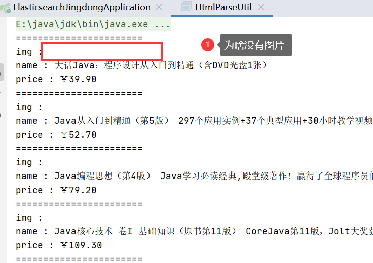

**原因是啥？**

> 一般图片特别多的网站，所有的图片都是通过延迟加载的

```java
// 打印标签内容
Elements lis = j_goodsList.getElementsByTag("li");
System.out.println(lis);

```

打印所有li标签，发现img标签中并没有属性src的设置，只是data-lazy-ing设置图片加载的地址

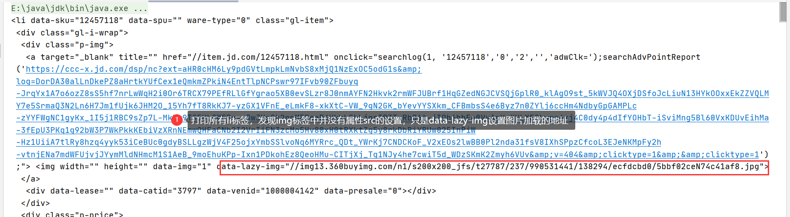

创建HtmlParseUtil、改写

- 更改图片获取属性为 `data-lazy-img`

- 与实体类结合，实体类如下

  ```java
  @Data
  @AllArgsConstructor
  @NoArgsConstructor
  public class Content implements Serializable {
      private static final long serialVersionUID = -8049497962627482693L;
      private String name;
      private String img;
      private String price;
  }
  
  ```

- 封装为方法

```java
package com.caojx.learn.utils;

import com.caojx.learn.pojo.Content;
import org.jsoup.Jsoup;
import org.jsoup.nodes.Document;
import org.jsoup.nodes.Element;
import org.jsoup.select.Elements;

import java.io.IOException;
import java.net.URL;
import java.util.ArrayList;
import java.util.List;

/**
 * @author caojx created on 2022/6/19 11:14 PM
 */
public class HtmlParseUtil {

    public static void main(String[] args) throws IOException {
        System.out.println(parseJD("java"));
    }

    public static List<Content> parseJD(String keyword) throws IOException {
        /// 使用前需要联网
        // 请求url
        String url = "http://search.jd.com/search?keyword=" + keyword;
        // 1.解析网页(jsoup 解析返回的对象是浏览器Document对象)
        Document document = Jsoup.parse(new URL(url), 30000);
        // 使用document可以使用在js对document的所有操作
        // 2.获取元素（通过id）
        Element j_goodsList = document.getElementById("J_goodsList");
        // 3.获取J_goodsList ul 每一个 li
        Elements lis = j_goodsList.getElementsByTag("li");
//        System.out.println(lis);
        // 4.获取li下的 img、price、name
        // list存储所有li下的内容
        List<Content> contents = new ArrayList<Content>();
        for (Element li : lis) {
            // 由于网站图片使用懒加载,将src属性替换为data-lazy-img
            String img = li.getElementsByTag("img").eq(0).attr("data-lazy-img");// 获取li下 第一张图片
            String name = li.getElementsByClass("p-name").eq(0).text();
            String price = li.getElementsByClass("p-price").eq(0).text();
            // 封装为对象
            Content content = new Content(name, img, price);
            // 添加到list中
            contents.add(content);
        }
//        System.out.println(contents);
        // 5.返回 list
        return contents;
    }
}


```

**结果展示**

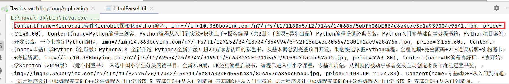

### 4、搜索高亮

> 在3、的基础上添加内容

**①ContentService**

```java
// 3、 在2的基础上进行高亮查询
public List<Map<String, Object>> highlightSearch(String keyword, Integer pageIndex, Integer pageSize) throws IOException {
    SearchRequest searchRequest = new SearchRequest("jd_goods");
    SearchSourceBuilder searchSourceBuilder = new SearchSourceBuilder();
    // 精确查询,添加查询条件
    TermQueryBuilder termQueryBuilder = QueryBuilders.termQuery("name", keyword);
    searchSourceBuilder.timeout(new TimeValue(60, TimeUnit.SECONDS));
    searchSourceBuilder.query(termQueryBuilder);
    // 分页
    searchSourceBuilder.from(pageIndex);
    searchSourceBuilder.size(pageSize);
    // 高亮 =========
    HighlightBuilder highlightBuilder = new HighlightBuilder();
    highlightBuilder.field("name");
    highlightBuilder.preTags("<span style='color:red'>");
    highlightBuilder.postTags("</span>");
    searchSourceBuilder.highlighter(highlightBuilder);
    // 执行查询
    searchRequest.source(searchSourceBuilder);
    SearchResponse searchResponse = restHighLevelClient.search(searchRequest, RequestOptions.DEFAULT);
    // 解析结果 ==========
    SearchHits hits = searchResponse.getHits();
    List<Map<String, Object>> results = new ArrayList<>();
    for (SearchHit documentFields : hits.getHits()) {
        // 使用新的字段值（高亮）,覆盖旧的字段值
        Map<String, Object> sourceAsMap = documentFields.getSourceAsMap();
        // 高亮字段
        Map<String, HighlightField> highlightFields = documentFields.getHighlightFields();
        HighlightField name = highlightFields.get("name");
        // 替换
        if (name != null) {
            Text[] fragments = name.fragments();
            StringBuilder new_name = new StringBuilder();
            for (Text text : fragments) {
                new_name.append(text);
            }
            sourceAsMap.put("name", new_name.toString());
        }
        results.add(sourceAsMap);
    }
    return results;
}
```

​    

**②ContentController**

```java
@ResponseBody
    @GetMapping("/h_search/{keyword}/{pageIndex}/{pageSize}")
    public List<Map<String, Object>> highlightParse(@PathVariable("keyword") String keyword,
                                                    @PathVariable("pageIndex") Integer pageIndex,
                                                    @PathVariable("pageSize") Integer pageSize) throws IOException {
        return contentService.highlightSearch(keyword, pageIndex, pageSize);
    }
```

**③结果展示**

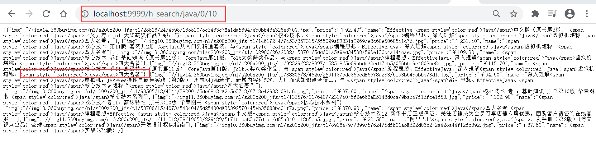

### 5、前后端分离（简单使用Vue）

> 删除Controller 方法上的 [@ResponseBody](https://github.com/ResponseBody)注解

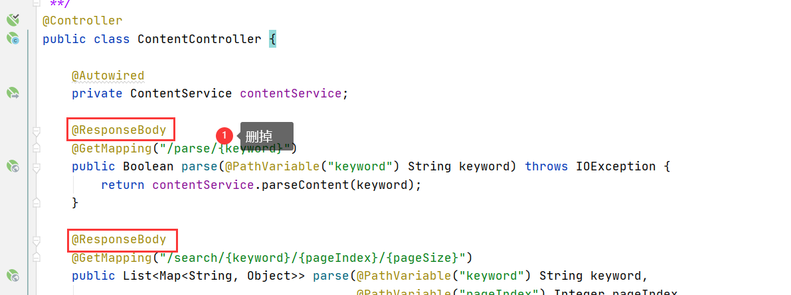

**①下载并引入Vue.min.js和axios.js**

> 如果安装了nodejs，可以按如下步骤，没有可以到后面素材处下载

```shell
npm install vue
npm install axios
```

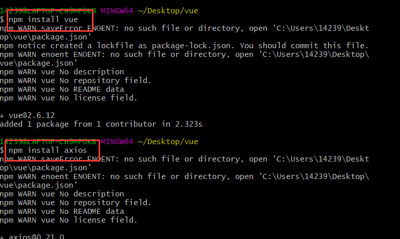

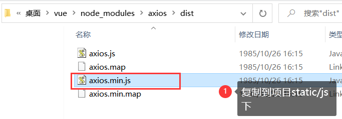

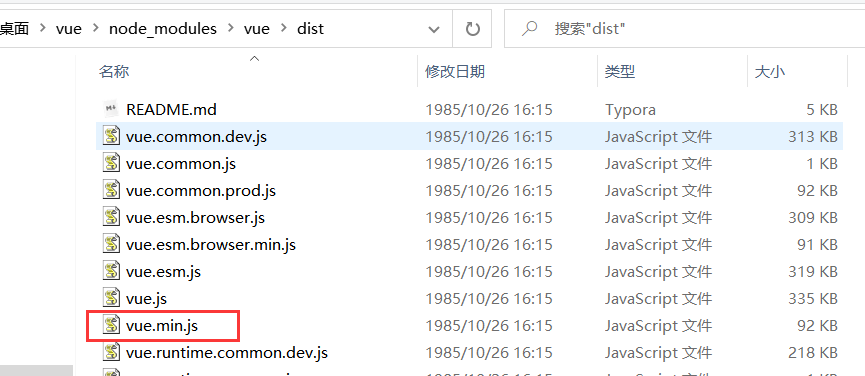

**②修改静态页面**

**引入js**

```java
<script th:src="@{/js/vue.min.js}"></script>
<script th:src="@{/js/axios.min.js}"></script>
```

**修改后的index.html**

```java
<!DOCTYPE html>
<html xmlns:th="http://www.thymeleaf.org" lang="zh">
<head>
    <meta charset="utf-8"/>
    <title>狂神说Java-ES仿京东实战</title>
    <link rel="stylesheet" th:href="@{/css/style.css}"/>

    <!--    <script th:src="@{/js/jquery.min.js}"></script>-->
    <!--    <script th:src="@{/js/axios.min.js}"></script>-->
    <!--    <script th:src="@{/js/vue.min.js}"></script>-->
</head>

<body class="pg">
<div class="page" id="app">
    <div id="mallPage" class=" mallist tmall- page-not-market ">

        <!-- 头部搜索 -->
        <div id="header" class=" header-list-app">
            <div class="headerLayout">
                <div class="headerCon ">
                    <!-- Logo-->
                    <h1 id="mallLogo">
                        
                    </h1>

                    <div class="header-extra">

                        <!--搜索-->
                        <div id="mallSearch" class="mall-search">
                            <form name="searchTop" class="mallSearch-form clearfix">
                                <fieldset>
                                    <legend>天猫搜索</legend>
                                    <div class="mallSearch-input clearfix">
                                        <div class="s-combobox" id="s-combobox-685">
                                            <div class="s-combobox-input-wrap">
                                                <input v-model="keyword" type="text" autocomplete="off" value="dd" id="mq"
                                                       class="s-combobox-input" aria-haspopup="true"/>
                                            </div>
                                        </div>
                                        <button type="submit" id="searchbtn" @click.prevent="searchKey" >搜索</button>
                                    </div>
                                </fieldset>
                            </form>
                            <ul class="relKeyTop">
                                <li><a>狂神说Java</a></li>
                                <li><a>狂神说前端</a></li>
                                <li><a>狂神说Linux</a></li>
                                <li><a>狂神说大数据</a></li>
                                <li><a>狂神聊理财</a></li>
                            </ul>
                        </div>
                    </div>
                </div>
            </div>
        </div>

        <!-- 商品详情页面 -->
        <div id="content">
            <div class="main">
                <!-- 品牌分类 -->
                <form class="navAttrsForm">
                    <div class="attrs j_NavAttrs" style="display:block">
                        <div class="brandAttr j_nav_brand">
                            <div class="j_Brand attr">
                                <div class="attrKey">
                                    品牌
                                </div>
                                <div class="attrValues">
                                    <ul class="av-collapse row-2">
                                        <li><a href="#"> 狂神说 </a></li>
                                        <li><a href="#"> Java </a></li>
                                    </ul>
                                </div>
                            </div>
                        </div>
                    </div>
                </form>

                <!-- 排序规则 -->
                <div class="filter clearfix">
                    <a class="fSort fSort-cur">综合<i class="f-ico-arrow-d"></i></a>
                    <a class="fSort">人气<i class="f-ico-arrow-d"></i></a>
                    <a class="fSort">新品<i class="f-ico-arrow-d"></i></a>
                    <a class="fSort">销量<i class="f-ico-arrow-d"></i></a>
                    <a class="fSort">价格<i class="f-ico-triangle-mt"></i><i class="f-ico-triangle-mb"></i></a>
                </div>

                <!-- 商品详情 -->
                <div class="view grid-nosku">

                    <div class="product" v-for="result in results">
                        <div class="product-iWrap">
                            <!--商品封面-->
                            <div class="productImg-wrap">
                                <a class="productImg">
                                    
                                </a>
                            </div>
                            <!--价格-->
                            <p class="productPrice">
                                <em><b>¥</b> {{result.price}}</em>
                            </p>
                            <!--标题-->
                            <p class="productTitle">
                                <a> {{result.title}} </a>
                            </p>
                            <!-- 店铺名 -->
                            <div class="productShop">
                                <span>店铺： 狂神说Java </span>
                            </div>
                            <!-- 成交信息 -->
                            <p class="productStatus">
                                <span>月成交<em>999笔</em></span>
                                <span>评价 <a>3</a></span>
                            </p>
                        </div>
                    </div>
                </div>
            </div>
        </div>
    </div>
</div>

<!--前端使用vue,实现前后端分离-->
<script th:src="@{/js/axios.min.js}"></script>
<script th:src="@{/js/vue.min.js}"></script>
<script>
    new Vue({
        el:"#app",
        data: {
            keyword:'',
            results:[]
        },
        methods:{
            addHttp(img){
                if(img){
                    img = 'https:'+img;
                }
                return img;
            },
            searchKey(){
                let keyword = this.keyword;
                axios.get('search/'+keyword+'/1/10').then(response=>{
                    console.log(response);
                    this.results = response.data;
                })
            }
        }
    })
</script>

</body>
</html>

```

**测试**

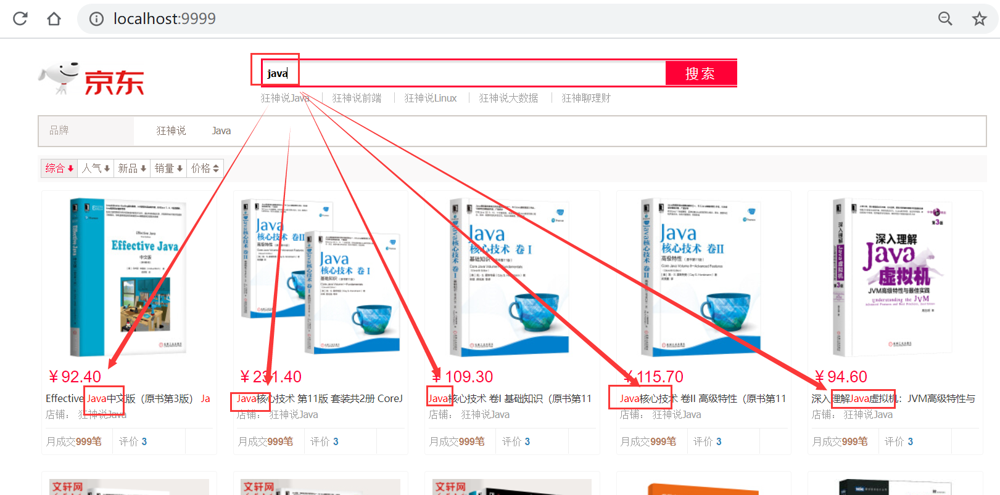

# 安装包及前端素材

链接：https://pan.baidu.com/s/1M5uWdYsCZyzIAOcgcRkA_A
提取码：qk8p
复制这段内容后打开百度网盘手机App，操作更方便哦

# 疑惑：

## 1、使用term（精确查询）时，我发现三个问题，问题如下：

- 字段值必须是一个词（索引中存在的词），才能匹配

  - 问题：中文字符串，term查询时无法查询到数据（比如，“编程”两字在文档中存在，但是搜索不到）

  - 原因：索引为配置中文分词器（默认使用standard，即所有中文字符串都会被切分为单个中文汉字作为单词），所以没有超过1个汉字的词，也就无法匹配，进而查不到数据

  - 解决：创建索引时配置中文分词器，如

    ```java
    PUT example
    {
      "mappings": {
        "properties": {
          "name":{
            "type": "text"，
            "analyzer": "ik_max_word"  // ik分词器
          }
        }
      }
    }
    ```

- 查询的英文字符只能是小写，大写都无效

- 查询时英文单词必须是完整的